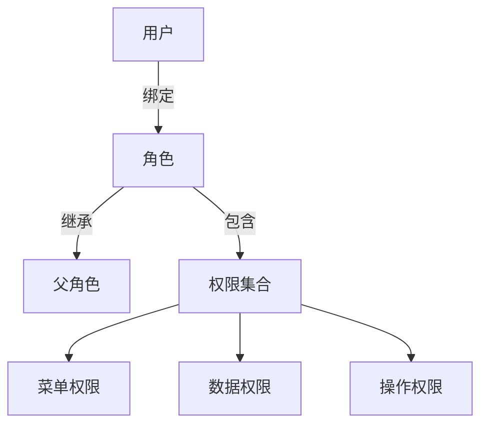
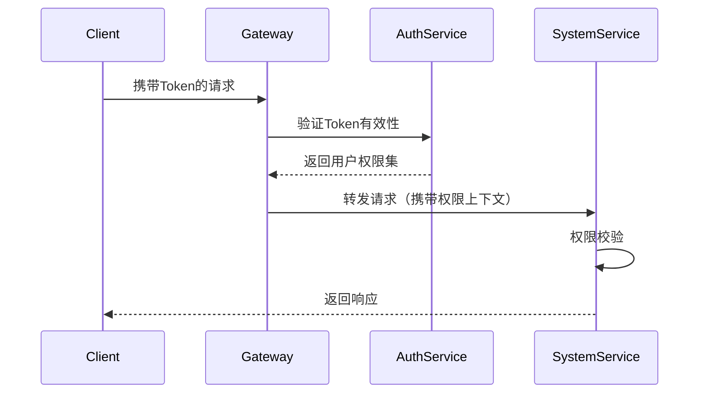

# 后台管理系统权限设计文档

## 一、权限模型设计

### 1.1 核心模型：RBAC1（角色层级模型）



### 1.2 权限维度定义

| 权限类型       | 说明                          | 示例                      |
|----------------|------------------------------|--------------------------|
| **菜单权限**   | 控制导航菜单可见性            | 系统管理/用户管理         |
| **操作权限**   | 控制按钮级操作权限            | 用户删除/角色分配         |
| **数据权限**   | 控制数据可见范围              | 本部门数据/个人数据       |

---

## 二、权限数据结构设计

### 2.1 核心表结构

```sql
-- 用户表
CREATE TABLE sys_user (
  user_id BIGINT PRIMARY KEY AUTO_INCREMENT,
  username VARCHAR(50) UNIQUE NOT NULL,
  password VARCHAR(100) NOT NULL
);

-- 角色表
CREATE TABLE sys_role (
  role_id BIGINT PRIMARY KEY AUTO_INCREMENT,
  role_name VARCHAR(50) NOT NULL,
  role_key VARCHAR(50) UNIQUE NOT NULL -- 角色标识符
);

-- 权限表
CREATE TABLE sys_permission (
  perm_id BIGINT PRIMARY KEY AUTO_INCREMENT,
  perm_name VARCHAR(50) NOT NULL,
  perm_key VARCHAR(100) NOT NULL UNIQUE, -- 格式: 模块:资源:操作
  perm_type TINYINT NOT NULL -- 0菜单 1操作 2数据
);

-- 关系表
CREATE TABLE sys_user_role (
  user_id BIGINT NOT NULL,
  role_id BIGINT NOT NULL,
  PRIMARY KEY(user_id, role_id)
);

CREATE TABLE sys_role_permission (
  role_id BIGINT NOT NULL,
  perm_id BIGINT NOT NULL,
  PRIMARY KEY(role_id, perm_id)
);
```

### 2.2 权限标识规范

```markdown
- **格式**: `模块:资源:操作`
- **示例**:
  - 用户管理菜单: `system:user:menu`
  - 删除用户权限: `system:user:delete`
  - 导出日志权限: `monitor:log:export`
```

---

## 三、权限验证流程

### 3.1 请求处理流程



### 3.2 权限验证实现

```typescript
// 权限守卫实现
@Injectable()
export class PermissionGuard implements CanActivate {
  constructor(private reflector: Reflector) {}

  async canActivate(context: ExecutionContext): Promise<boolean> {
    const requiredPerms = this.reflector.get<string[]>(
      'permissions',
      context.getHandler()
    );

    if (!requiredPerms) return true;

    const request = context.switchToHttp().getRequest();
    const userPerms: string[] = request.user.permissions;

    return requiredPerms.every(perm => userPerms.includes(perm));
  }
}
```

---

## 四、数据权限设计

### 4.1 数据权限类型

| 权限级别       | SQL条件示例                    | 适用场景               |
|----------------|-------------------------------|-----------------------|
| **全部数据**   | 无附加条件                    | 系统管理员            |
| **本部门数据** | `dept_id IN (允许的部门ID)`    | 部门主管              |
| **本人数据**   | `create_by = #{currentUserId}`| 普通员工              |
| **自定义范围** | 动态拼接条件                  | 特殊业务场景          |

### 4.2 实现方案

```typescript
// 数据权限装饰器
export const DataScope = (scopeType: DataScopeType) => {
  return SetMetadata('dataScope', scopeType);
};

// AOP拦截器实现
@Interceptor()
export class DataScopeInterceptor implements NestInterceptor {
  intercept(context: ExecutionContext, next: CallHandler) {
    const scopeType = this.reflector.get<DataScopeType>(
      'dataScope',
      context.getHandler()
    );

    const user = context.switchToHttp().getRequest().user;

    // 根据权限类型动态修改查询条件
    modifyQueryBuilder(scopeType, user);

    return next.handle();
  }
}
```

---

## 五、权限管理接口

### 5.1 权限分配接口

```markdown
- **接口地址**: PUT /system/roles/{roleId}/permissions
- **请求示例**:
```json
{
  "permKeys": [
    "system:user:create",
    "system:user:export",
    "monitor:log:list"
  ]
}
```

### 5.2 用户角色分配

```markdown
- **接口地址**: POST /system/users/{userId}/roles
- **请求示例**:
```json
{
  "roleKeys": ["admin", "auditor"]
}
```

---

## 六、安全设计

### 6.1 权限变更审计

```typescript
// 角色权限变更记录
@Entity()
export class RolePermHistory {
  @PrimaryGeneratedColumn()
  id: number;

  @Column()
  roleId: number;

  @Column('json')
  oldPerms: string[];

  @Column('json')
  newPerms: string[];

  @Column()
  operatorId: number;
}
```

### 6.2 防越权攻击

```markdown
1. **接口级校验**：
   - 修改用户信息接口必须校验操作者权限
   - 禁止普通用户修改角色信息

2. **数据级校验**：
   - 更新数据时验证数据归属
   - 删除操作增加二次确认

3. **日志追踪**：
   - 记录敏感操作原始IP
   - 关键操作需要二次认证
```

---

## 七、性能优化方案

### 7.1 权限缓存策略


### 7.2 缓存更新机制

```markdown
- **更新策略**：
  1. 角色权限变更 → 清除相关用户缓存
  2. 用户角色变更 → 立即清除该用户缓存
  3. 定时任务 → 每日凌晨刷新全量缓存

- **缓存数据结构**：
```redis
HSET user:perms <userId> <JSON权限集合>
```

---

## 八、扩展设计

### 8.1 动态权限管理

```typescript
// 动态权限加载服务
@Injectable()
export class DynamicPermService {
  async registerNewPermission(
    module: string,
    resource: string,
    actions: string[]
  ) {
    // 自动生成权限标识并持久化
  }
}
```

### 8.2 租户隔离方案

```markdown
- **实现方式**：
  1. 在权限Key中添加租户标识：`{tenant}:system:user:create`
  2. 数据查询自动附加租户ID条件
  3. 角色体系按租户隔离
```

---

## 附录：典型场景示例

### 场景：部门主管权限配置

```markdown
1. **角色创建**：
   - 角色名称：技术部主管
   - 权限标识：`system:user:menu`, `system:user:query`

2. **数据权限**：
   - 查看本部门用户数据
   - 不能执行删除操作

3. **用户分配**：
   - 将角色绑定到部门主管用户
   - 自动继承部门树权限
```
