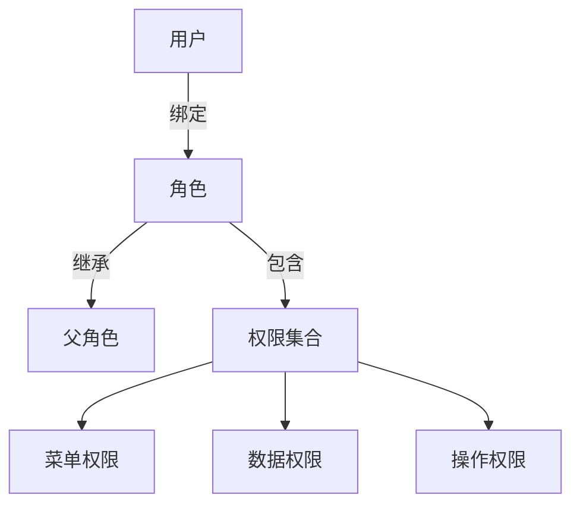
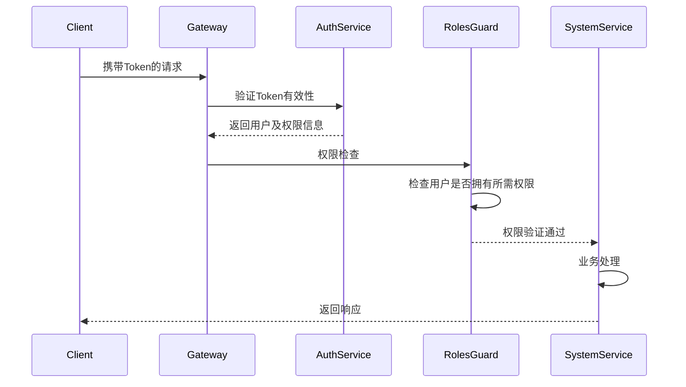
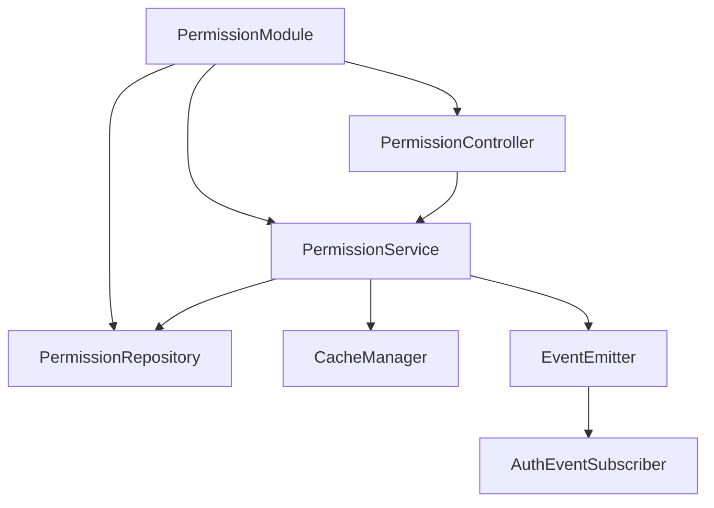

# 后台管理系统权限设计文档

## 一、权限模型设计

### 1.1 核心模型：RBAC1（角色层级模型）



### 1.2 权限维度定义

| 权限类型       | 说明                          | 示例                      |
|----------------|------------------------------|--------------------------|
| **菜单权限**   | 控制导航菜单可见性            | 系统管理/用户管理         |
| **操作权限**   | 控制按钮级操作权限            | 用户删除/角色分配         |
| **数据权限**   | 控制数据可见范围              | 本部门数据/个人数据       |

---

## 二、权限数据结构设计

### 2.1 核心表结构

```sql
-- 用户表
CREATE TABLE sys_user (
  id UUID PRIMARY KEY,
  username VARCHAR(50) UNIQUE NOT NULL,
  password VARCHAR(100) NOT NULL,
  -- 其他用户信息字段
  created_at TIMESTAMP DEFAULT CURRENT_TIMESTAMP,
  updated_at TIMESTAMP DEFAULT CURRENT_TIMESTAMP
);

-- 角色表
CREATE TABLE sys_role (
  id UUID PRIMARY KEY,
  role_name VARCHAR(50) NOT NULL,
  role_key VARCHAR(50) UNIQUE NOT NULL, -- 角色标识符
  parent_id UUID, -- 父角色ID，支持角色继承
  data_scope TINYINT DEFAULT 1, -- 数据权限范围：1全部，2自定义，3本部门，4本部门及以下，5仅本人
  created_at TIMESTAMP DEFAULT CURRENT_TIMESTAMP,
  updated_at TIMESTAMP DEFAULT CURRENT_TIMESTAMP
);

-- 权限表
CREATE TABLE sys_permission (
  id UUID PRIMARY KEY,
  perm_name VARCHAR(50) NOT NULL,
  perm_key VARCHAR(100) NOT NULL UNIQUE, -- 格式: 模块:资源:操作
  perm_type TINYINT NOT NULL, -- 0菜单 1操作 2数据
  parent_id UUID, -- 父权限ID，支持权限树结构
  created_at TIMESTAMP DEFAULT CURRENT_TIMESTAMP,
  updated_at TIMESTAMP DEFAULT CURRENT_TIMESTAMP
);

-- 关系表
CREATE TABLE sys_user_role (
  user_id UUID NOT NULL,
  role_id UUID NOT NULL,
  PRIMARY KEY(user_id, role_id)
);

CREATE TABLE sys_role_permission (
  role_id UUID NOT NULL,
  permission_id UUID NOT NULL,
  PRIMARY KEY(role_id, permission_id)
);

-- 权限审计表
CREATE TABLE sys_permission_audit (
  id UUID PRIMARY KEY,
  operation_type TINYINT NOT NULL, -- 1角色权限变更 2用户角色变更
  target_id UUID NOT NULL, -- 目标角色或用户ID
  target_name VARCHAR(50) NOT NULL, -- 目标名称
  before_data JSON, -- 变更前数据
  after_data JSON, -- 变更后数据
  operator_id UUID NOT NULL, -- 操作人ID
  operator_name VARCHAR(50) NOT NULL, -- 操作人名称
  operator_ip VARCHAR(50) NOT NULL, -- 操作IP
  created_at TIMESTAMP DEFAULT CURRENT_TIMESTAMP
);
```

### 2.2 权限标识规范

```markdown
- **格式**: `模块:资源:操作`
- **示例**:
  - 用户管理菜单: `system:user:menu`
  - 删除用户权限: `system:user:delete`
  - 导出日志权限: `system:log:export`
```

---

## 三、权限验证流程

### 3.1 请求处理流程



### 3.2 权限验证实现

```typescript
// 权限守卫实现
@Injectable()
export class RolesGuard implements CanActivate {
  constructor(
    private reflector: Reflector,
    private configService: ConfigService,
  ) {}

  async canActivate(context: ExecutionContext): Promise<boolean> {
    // 获取路由上设置的所需权限
    const requiredPerms = this.reflector.get<string[]>(
      'permissions',
      context.getHandler()
    );

    if (!requiredPerms) return true;

    const request = context.switchToHttp().getRequest();
    const user = request.user;

    // 检查超级管理员（可以自动拥有所有权限）
    if (user.isAdmin) return true;

    // 检查用户权限
    return requiredPerms.every(perm => user.permissions.includes(perm));
  }
}
```

### 3.3 权限装饰器使用

```typescript
// 控制器中使用权限装饰器
@Controller('users')
export class UserController {
  @Get()
  @RequirePermissions('system:user:list')
  findAll() {
    // 实现查询逻辑
  }

  @Post()
  @RequirePermissions('system:user:create')
  create(@Body() createUserDto: CreateUserDto) {
    // 实现创建逻辑
  }
}
```

---

## 四、数据权限设计

### 4.1 数据权限类型

| 权限级别       | SQL条件示例                    | 适用场景               |
|----------------|-------------------------------|-----------------------|
| **全部数据**   | 无附加条件                    | 系统管理员            |
| **本部门数据** | `dept_id IN (允许的部门ID)`    | 部门主管              |
| **本人数据**   | `created_by = #{currentUserId}`| 普通员工              |
| **自定义范围** | 动态拼接条件                  | 特殊业务场景          |

### 4.2 实现方案

```typescript
// 数据权限装饰器
export const DataScope = (scopeType: DataScopeType) => {
  return SetMetadata('dataScope', scopeType);
};

// AOP拦截器实现
@Injectable()
export class DataScopeInterceptor implements NestInterceptor {
  intercept(context: ExecutionContext, next: CallHandler) {
    const scopeType = this.reflector.get<DataScopeType>(
      'dataScope',
      context.getHandler()
    );

    const user = context.switchToHttp().getRequest().user;

    // 根据权限类型动态修改查询条件
    modifyQueryBuilder(scopeType, user);

    return next.handle();
  }
}
```

---

## 五、权限管理接口

### 5.1 权限分配接口

```markdown
- **接口地址**: PUT /api/v1/permission/roles/{roleId}/permissions
- **请求示例**:
```json
{
  "permKeys": [
    "system:user:create",
    "system:user:export",
    "monitor:log:list"
  ]
}
```

### 5.2 用户角色分配

```markdown
- **接口地址**: PUT /api/v1/permission/users/{userId}/roles
- **请求示例**:
```json
{
  "roleKeys": ["admin", "auditor"]
}
```

---

## 六、安全设计

### 6.1 权限变更审计

```typescript
// 角色权限变更记录
@Entity()
export class PermissionAuditEntity {
  @PrimaryGeneratedColumn('uuid')
  id: string;

  @Column()
  operationType: number;

  @Column()
  targetId: string;

  @Column()
  targetName: string;

  @Column('json')
  beforeData: string;

  @Column('json')
  afterData: string;

  @Column()
  operatorId: string;

  @Column()
  operatorName: string;

  @Column()
  operatorIp: string;
}
```

### 6.2 防越权攻击

```markdown
1. **接口级校验**：
   - 修改用户信息接口必须校验操作者权限
   - 禁止普通用户修改角色信息

2. **数据级校验**：
   - 更新数据时验证数据归属
   - 删除操作增加二次确认

3. **日志追踪**：
   - 记录敏感操作原始IP
   - 关键操作需要二次认证
```

---

## 七、性能优化方案

### 7.1 权限缓存策略


### 7.2 权限缓存失效策略

1. **基于时间**：设置固定的缓存过期时间（如30分钟）
2. **基于操作**：当角色权限变更或用户角色变更时，主动清除相关缓存
3. **定向清除**：仅清除受影响用户的权限缓存，不影响其他用户

---

## 八、系统初始化

### 8.1 初始权限和角色

系统初始化时会自动创建以下基础数据：

1. **超级管理员角色**：
   - 角色标识：`admin`
   - 数据权限：全部数据
   - 拥有所有系统权限

2. **普通用户角色**：
   - 角色标识：`common`
   - 数据权限：仅本人数据
   - 仅拥有基本查询权限

3. **默认管理员用户**：
   - 用户名：`admin`
   - 默认密码：`admin123`
   - 角色：超级管理员

### 8.2 初始化命令

可以通过以下命令初始化系统基础数据：

```bash
# 运行数据库迁移和种子脚本
npm run db:init
```

---

## 九、常见问题与解决方案

### 9.1 权限检查失败

**问题**：用户无法访问应该有权限的功能

**原因**：

1. JWT中没有包含权限信息
2. 权限缓存未更新
3. 权限标识不匹配

**解决方案**：

1. 检查`auth.service.ts`中的登录方法是否正确加载了用户权限
2. 手动清除权限缓存：`await cacheManager.del('user:userId:permissions')`
3. 确认控制器中的权限装饰器标识与数据库中的权限标识一致

### 9.2 超级管理员权限丢失

**问题**：超级管理员无法访问系统功能

**解决方案**：

1. 检查配置文件中的`adminRoleKey`是否与数据库中管理员角色的`roleKey`一致
2. 确保JWT策略中正确处理了`isAdmin`标志
3. 使用数据库工具直接修复管理员角色和权限关系

### 9.3 系统初始化

**问题**：新系统无法正常使用权限功能

**解决方案**：

1. 运行初始化脚本：`npm run db:init`
2. 手动创建基础数据：

   ```sql
   INSERT INTO sys_role (id, role_name, role_key, data_scope) VALUES (uuid(), '超级管理员', 'admin', 1);
   INSERT INTO sys_user (id, username, password) VALUES (uuid(), 'admin', '加密后的密码');
   INSERT INTO sys_user_role (user_id, role_id) VALUES ('用户ID', '角色ID');
   ```

---

## 十、开发建议

1. **权限命名规范**：严格遵循`模块:资源:操作`的命名规范，保持系统一致性
2. **权限粒度**：权限粒度不宜过细，建议控制在300个以内，避免维护困难
3. **角色设计**：设计角色时考虑业务场景，避免角色过多导致管理混乱
4. **测试验证**：开发新功能时，务必测试不同角色的访问权限
5. **权限调试**：开发环境可通过配置`enablePermissionCheck=false`临时禁用权限检查便于调试

---

## 十一、权限模块实现详情

### 11.1 权限模块架构



### 11.2 权限服务实现

权限服务（PermissionService）是权限系统的核心组件，负责：

1. 获取用户权限列表
2. 检查用户是否具有特定权限
3. 管理角色的权限分配
4. 处理权限缓存逻辑

```typescript
@Injectable()
export class PermissionService {
  constructor(
    @InjectRepository(PermissionEntity)
    private permissionRepository: Repository<PermissionEntity>,
    @InjectRepository(RoleEntity)
    private roleRepository: Repository<RoleEntity>,
    @InjectRepository(UserEntity)
    private userRepository: Repository<UserEntity>,
    private cacheManager: CacheManager,
    private configService: ConfigService,
    private eventEmitter: EventEmitter2,
  ) {}

  /**
   * 获取用户所有权限
   * @param userId 用户ID
   * @returns 权限标识列表
   */
  async getUserPermissions(userId: string): Promise<string[]> {
    // 缓存实现
    const cacheKey = `user:${userId}:permissions`;
    const ttl = this.configService.get('app.permissionCacheTtl', 1800);

    // 尝试从缓存获取
    const cachedPermissions = await this.cacheManager.get<string[]>(cacheKey);
    if (cachedPermissions) {
      return cachedPermissions;
    }

    // 数据库查询
    const permissions = await this.queryUserPermissions(userId);

    // 存入缓存
    await this.cacheManager.set(cacheKey, permissions, ttl);

    return permissions;
  }

  /**
   * 查询用户角色和权限
   */
  private async queryUserPermissions(userId: string): Promise<string[]> {
    // 复杂查询，获取用户所有角色(包括继承的角色)的所有权限
    // 查询实现...

    return permissionKeys;
  }

  /**
   * 分配角色权限
   */
  async assignRolePermissions(roleId: string, permissionIds: string[], operator: OperatorInfo): Promise<void> {
    // 权限变更实现
    // 1. 保存变更前数据(审计)
    // 2. 更新角色权限
    // 3. 记录审计日志
    // 4. 清除相关缓存
    // 5. 触发权限变更事件
  }

  /**
   * 清除用户权限缓存
   */
  async clearUserPermissionCache(userId: string | string[]): Promise<void> {
    const userIds = Array.isArray(userId) ? userId : [userId];
    const multi = this.cacheManager.store.getClient();

    // 批量删除缓存
    const keys = userIds.map(id => `user:${id}:permissions`);
    await multi.del(keys);
  }
}
```

### 11.3 权限守卫实现

权限守卫（RolesGuard）负责：

1. 检查用户是否有访问特定路由的权限
2. 处理超级管理员权限逻辑
3. 记录权限检查日志

```typescript
@Injectable()
export class RolesGuard implements CanActivate {
  private readonly logger = new Logger(RolesGuard.name);
  private readonly adminRoleKey: string;

  constructor(
    private reflector: Reflector,
    private configService: ConfigService,
  ) {
    this.adminRoleKey = configService.get('app.adminRoleKey', 'admin');
  }

  async canActivate(context: ExecutionContext): Promise<boolean> {
    // 获取路由上设置的角色和权限
    const requiredRoles = this.reflector.getAllAndOverride<string[]>(ROLES_KEY, [
      context.getHandler(),
      context.getClass(),
    ]);

    const requiredPermissions = this.reflector.getAllAndOverride<string[]>(PERMISSIONS_KEY, [
      context.getHandler(),
      context.getClass(),
    ]);

    // 如果未设置权限要求，则放行
    if (!requiredRoles && !requiredPermissions) {
      return true;
    }

    const request = context.switchToHttp().getRequest();
    const user = request.user;

    // 检查超级管理员权限
    if (user.isAdmin || user.roles?.includes(this.adminRoleKey)) {
      return true;
    }

    // 检查角色权限
    if (requiredRoles && !requiredRoles.some(role => user.roles?.includes(role))) {
      throw new ForbiddenException('角色权限不足');
    }

    // 检查功能权限
    if (requiredPermissions && !requiredPermissions.some(perm => user.permissions?.includes(perm))) {
      throw new ForbiddenException('操作权限不足');
    }

    return true;
  }
}
```

### 11.4 权限缓存与事件处理

权限系统使用Redis缓存优化性能，同时使用事件系统确保权限变更时缓存及时失效：

```typescript
@Injectable()
export class AuthEventSubscriber {
  constructor(
    private permissionService: PermissionService,
    private userService: UserService,
  ) {}

  @OnEvent('role.permissions.changed')
  async handleRolePermissionsChanged(payload: { roleId: string }) {
    // 1. 获取拥有此角色的所有用户
    const userIds = await this.userService.findUserIdsByRoleId(payload.roleId);

    // 2. 清除这些用户的权限缓存
    if (userIds.length > 0) {
      await this.permissionService.clearUserPermissionCache(userIds);
    }
  }

  @OnEvent('user.roles.changed')
  async handleUserRolesChanged(payload: { userId: string }) {
    // 清除指定用户的权限缓存
    await this.permissionService.clearUserPermissionCache(payload.userId);
  }
}
```

### 11.5 数据权限拦截器

数据权限拦截器用于限制用户可访问的数据范围：

```typescript
@Injectable()
export class DataScopeInterceptor implements NestInterceptor {
  constructor(
    private reflector: Reflector,
    private permissionService: PermissionService,
  ) {}

  async intercept(context: ExecutionContext, next: CallHandler): Promise<Observable<any>> {
    const dataScope = this.reflector.get<DataScopeType>('dataScope', context.getHandler());
    if (!dataScope) {
      return next.handle();
    }

    const request = context.switchToHttp().getRequest();
    const user = request.user;

    // 判断用户数据权限级别
    const userDataScope = await this.permissionService.getUserDataScope(user.userId);

    // 修改查询条件
    let query = request.query || {};

    // 不同数据权限级别处理逻辑
    switch (userDataScope) {
      case 1: // 全部数据
        break;
      case 2: // 自定义数据
        const deptIds = await this.permissionService.getUserCustomDataScope(user.userId);
        query.deptIds = deptIds;
        break;
      case 3: // 本部门数据
        query.deptId = user.deptId;
        break;
      case 4: // 部门及以下
        const childDeptIds = await this.permissionService.getChildDeptIds(user.deptId);
        query.deptIds = [user.deptId, ...childDeptIds];
        break;
      case 5: // 仅本人
      default:
        query.createdBy = user.userId;
    }

    // 修改请求中的查询参数
    request.query = query;

    return next.handle();
  }
}
```

### 11.6 权限审计日志

权限变更审计是安全合规的重要部分：

```typescript
@Injectable()
export class PermissionAuditService {
  constructor(
    @InjectRepository(PermissionAuditEntity)
    private auditRepository: Repository<PermissionAuditEntity>,
    private requestService: RequestContextService,
  ) {}

  /**
   * 记录权限变更审计
   */
  async recordAudit(params: {
    operationType: number;
    targetId: string;
    targetName: string;
    beforeData: any;
    afterData: any;
  }): Promise<void> {
    const operator = this.requestService.getCurrentUser();
    const ip = this.requestService.getClientIp();

    const audit = this.auditRepository.create({
      ...params,
      operatorId: operator.userId,
      operatorName: operator.username,
      operatorIp: ip,
    });

    await this.auditRepository.save(audit);
  }

  /**
   * 查询权限审计日志
   */
  async queryAuditLogs(query: PermissionAuditQueryDto): Promise<PageResult<PermissionAuditEntity>> {
    // 分页查询实现
  }
}
```

## 十二、权限系统部署与运维

### 12.1 部署注意事项

1. **Redis缓存**：确保配置了权限系统使用的Redis服务器
2. **数据库索引**：权限表和关系表需要建立适当索引提高查询性能
3. **超时配置**：服务间通信需要设置合理的超时时间
4. **监控告警**：配置权限检查失败的监控告警

### 12.2 性能监控指标

1. **权限检查耗时**：监控权限验证的平均耗时
2. **缓存命中率**：监控权限缓存的命中率
3. **权限拒绝率**：监控系统的权限拒绝比例
4. **API请求延迟**：监控权限相关API的响应时间

### 12.3 故障应急预案

1. **权限缓存故障**：提供紧急清除所有权限缓存的接口
2. **超级管理员权限恢复**：提供命令行工具直接修复管理员权限
3. **权限降级策略**：允许在特定情况下临时禁用权限校验
4. **日志增强**：发生故障时自动开启详细日志模式
