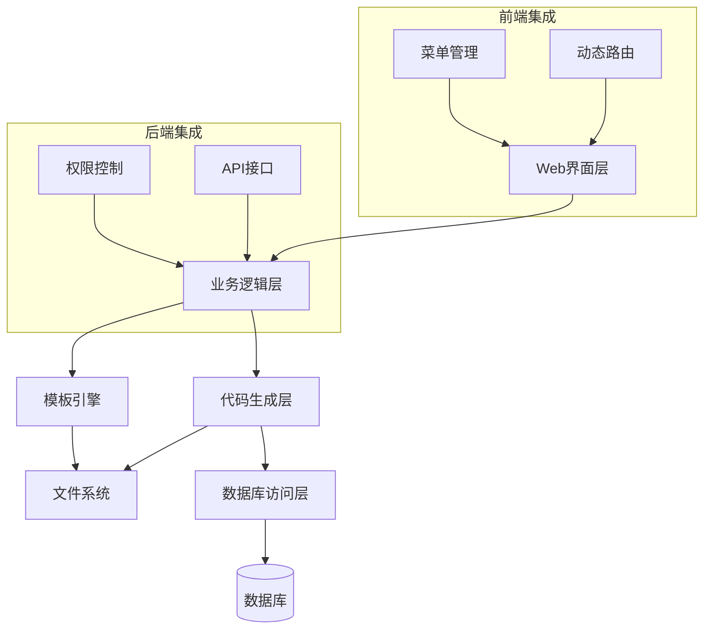
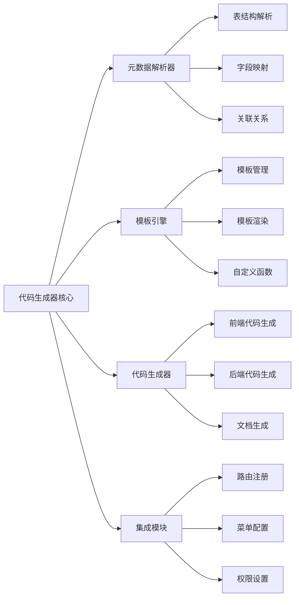
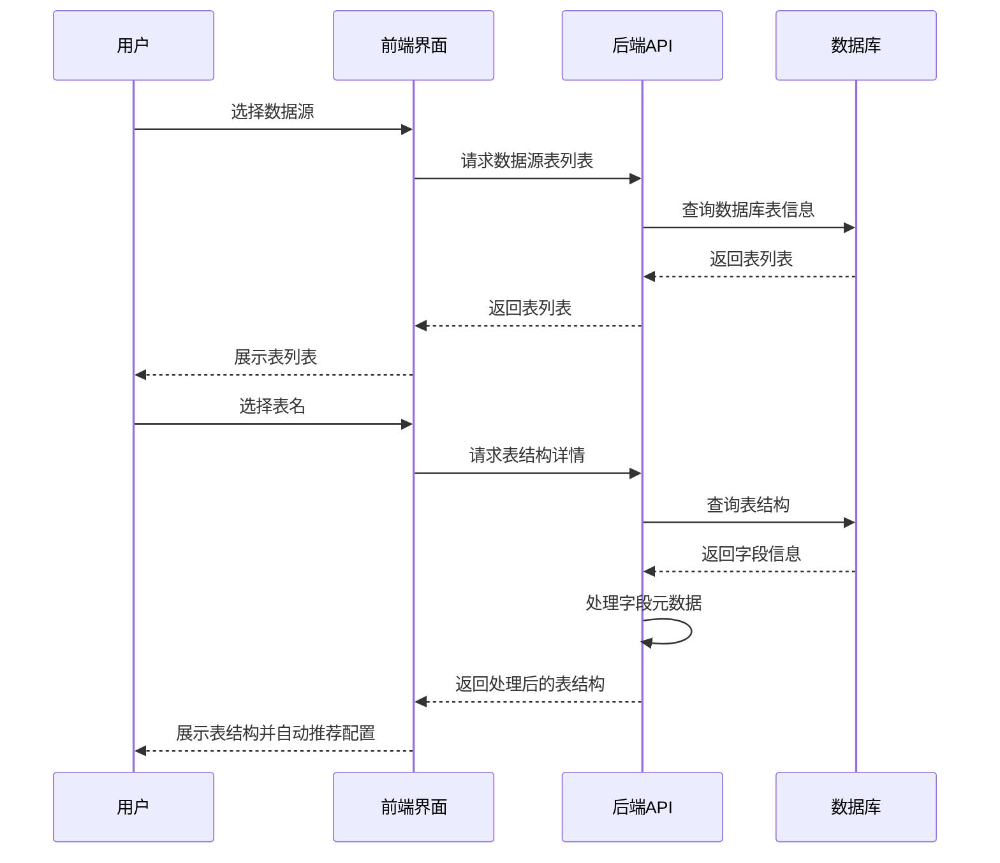
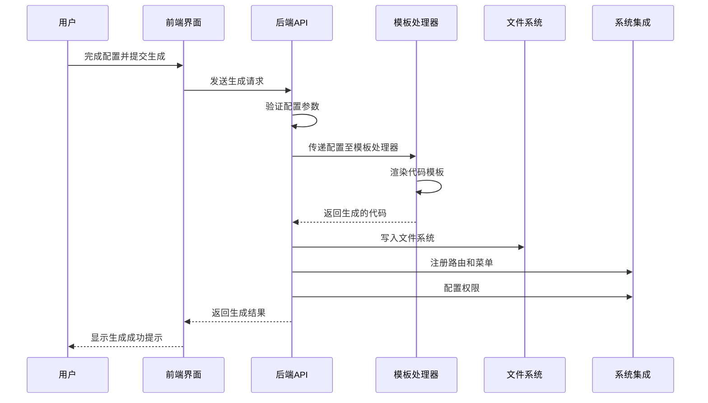
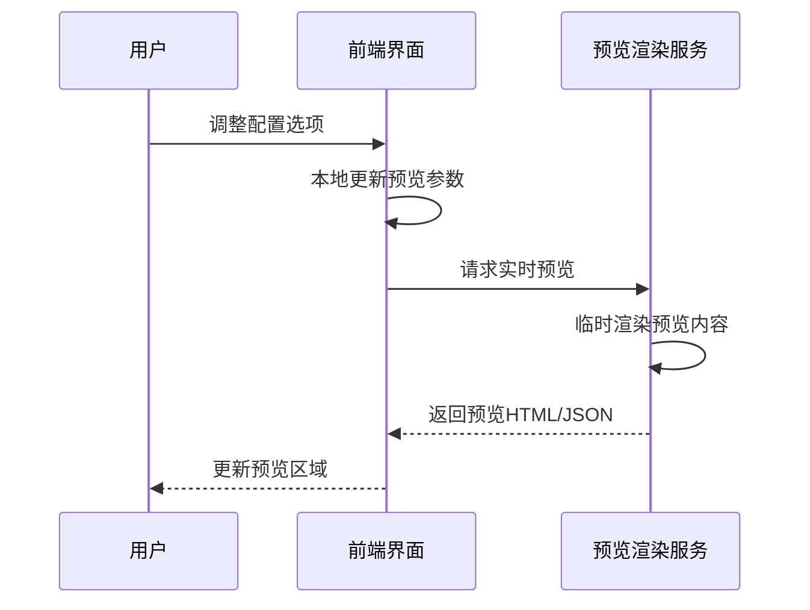
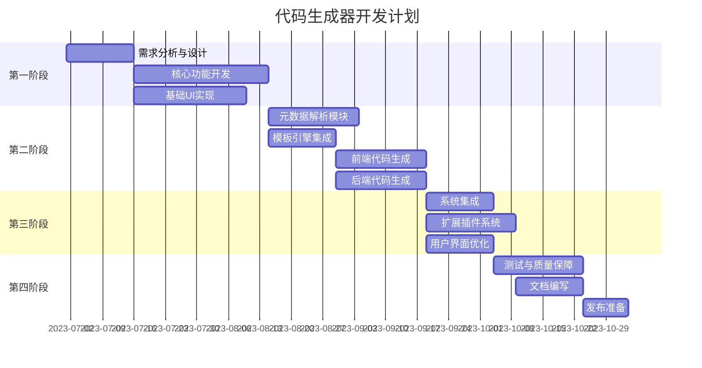

# 代码生成器功能设计方案

## 一、设计愿景

### 1.1 产品定位

代码生成器是AdminFlow后台管理系统的核心功能模块，旨在提供一套完整的低代码开发解决方案，让系统管理员、产品经理和业务人员能够在不编写代码的情况下，通过可视化操作快速构建业务功能模块，实现业务需求的敏捷交付。

### 1.2 核心目标

- **无代码生成**：通过可视化界面操作，零代码完成功能模块生成
- **完整闭环**：支持从数据库设计到功能实现的全流程自动化
- **实时预览**：所见即所得，实时预览生成效果
- **易用性优先**：面向非技术人员设计，降低使用门槛
- **高度集成**：与系统其他模块无缝集成，统一用户体验
- **扩展灵活**：支持模板定制、组件扩展和业务规则配置

### 1.3 用户画像

| 角色 | 使用需求 | 关注点 |
|-----|--------|-------|
| 系统管理员 | 快速构建管理功能 | 易用性、稳定性 |
| 产品经理 | 快速验证产品原型 | 预览效果、灵活性 |
| 业务人员 | 临时数据管理需求 | 简单操作、功能完整性 |
| 初级开发者 | 学习系统架构 | 代码规范、最佳实践 |

## 二、系统架构设计

### 2.1 整体架构



### 2.2 核心模块结构



### 2.3 技术栈选型

| 层级 | 技术选型 | 说明 |
|-----|---------|-----|
| 前端框架 | Vue3 + TypeScript | 与现有系统保持一致 |
| UI组件库 | Element Plus | 丰富的组件体系，统一风格 |
| 状态管理 | Pinia | 响应式数据流管理 |
| 后端框架 | NestJS | 模块化架构，易于扩展 |
| 模板引擎 | Handlebars | 强大的模板语法，易于扩展 |
| 数据库交互 | TypeORM | ORM映射，简化数据操作 |
| 文件处理 | fs-extra | 增强的文件操作能力 |

## 三、核心功能模块

### 3.1 数据源管理

#### 3.1.1 数据源配置

- 支持配置多种数据库连接（MySQL、PostgreSQL等）
- 数据源信息加密存储，保障安全性
- 支持测试连接功能，确保配置正确
- 根据权限动态显示可用数据源

#### 3.1.2 表结构解析

- 自动解析数据库表结构
- 识别字段类型、长度、约束条件
- 解析表间关联关系
- 支持表注释和字段注释的解析
- 提供表结构可视化展示

#### 3.1.3 元数据管理

- 缓存表结构元数据，提升性能
- 支持手动刷新表结构
- 提供表结构变更对比功能
- 支持表结构版本管理

### 3.2 可视化配置

#### 3.2.1 基础信息配置

- 模块名称、描述、图标设置
- 功能分类与菜单位置配置
- 权限策略配置
- 国际化配置选项

#### 3.2.2 功能页面配置

- 列表页配置（分页、排序、筛选条件）
- 表单页配置（布局、校验规则、默认值）
- 详情页配置（字段展示、关联数据展示）
- 批量操作配置（导入导出、批量删除等）

#### 3.2.3 字段配置

- 字段展示规则（显示/隐藏、顺序调整）
- 字段控件映射（根据数据类型智能推荐）
- 字段校验规则配置
- 字段权限控制
- 枚举值与展示文本映射

#### 3.2.4 高级配置

- 自定义按钮与操作
- 自定义查询条件
- 数据联动规则配置
- 工作流集成配置
- 自定义钩子函数配置点

### 3.3 预览与生成

#### 3.3.1 实时预览

- 配置变更实时预览
- 支持模拟数据交互
- 多设备响应式预览（PC/平板/手机）
- 主题切换预览

#### 3.3.2 代码生成

- 前端代码生成（Vue组件、API调用、类型定义）
- 后端代码生成（Controller、Service、Entity等）
- 数据库迁移脚本生成
- API文档生成
- 单元测试代码生成

#### 3.3.3 部署集成

- 自动注册路由
- 自动更新菜单
- 自动配置权限
- 热更新支持，无需重启系统
- 版本管理与回滚机制

### 3.4 模板管理

#### 3.4.1 内置模板

- 标准列表模板（表格形式）
- 卡片列表模板
- 树形列表模板
- 标准表单模板
- 分步表单模板
- 详情展示模板

#### 3.4.2 模板定制

- 模板编辑器
- 模板参数配置
- 模板导入导出
- 模板版本管理
- 模板市场集成

#### 3.4.3 风格主题

- 主题切换功能
- 颜色方案配置
- 组件风格定制
- 布局方案选择

## 四、用户界面设计

### 4.1 总体布局

代码生成器界面采用直观的分栏布局，让用户能够清晰地完成配置流程：

```
+------------------------------------------------------+
|                      顶部导航栏                       |
+------+-------------------------+--------------------+
|      |                         |                    |
|      |                         |                    |
|      |                         |                    |
| 左侧 |      中间配置区域        |     右侧预览区     |
| 步骤 |                         |                    |
| 导航 |                         |                    |
|      |                         |                    |
|      |                         |                    |
+------+-------------------------+--------------------+
|                      底部操作栏                      |
+------------------------------------------------------+
```

### 4.2 主要功能区描述

1. **顶部导航栏**：显示当前模块名称、保存按钮、帮助文档入口
2. **左侧步骤导航**：清晰展示配置流程步骤，指示当前进度
3. **中间配置区域**：根据当前步骤显示相应的配置表单
4. **右侧预览区**：实时展示配置效果，支持PC/移动设备切换
5. **底部操作栏**：提供上一步、下一步、保存草稿、生成代码等操作按钮

### 4.3 操作流程设计

用户操作流程设计为线性引导式，确保即使是首次使用的用户也能轻松完成：

1. **选择数据源** → 2. **选择数据表** → 3. **基础信息配置** → 4. **字段配置** → 5. **功能配置** → 6. **预览确认** → 7. **生成部署**

## 五、详细实现方案

### 5.1 数据模型设计

#### 5.1.1 数据源配置模型

```typescript
// 数据源配置实体
@Entity('gen_datasource')
export class GenDatasource {
  @PrimaryGeneratedColumn()
  id: number;

  @Column({ length: 50 })
  name: string;

  @Column({ length: 20 })
  type: string;  // mysql, postgresql, etc.

  @Column({ length: 100 })
  host: string;

  @Column()
  port: number;

  @Column({ length: 50 })
  username: string;

  @Column({ type: 'text', select: false })
  password: string;

  @Column({ length: 50 })
  database: string;

  @Column({ default: true })
  isActive: boolean;

  @Column({ type: 'text', nullable: true })
  options: string;  // JSON string for additional options

  @CreateDateColumn()
  createdAt: Date;

  @UpdateDateColumn()
  updatedAt: Date;
}
```

#### 5.1.2 代码生成配置模型

```typescript
// 代码生成配置实体
@Entity('gen_config')
export class GenConfig {
  @PrimaryGeneratedColumn()
  id: number;

  @Column({ length: 100 })
  moduleName: string;

  @Column({ length: 200, nullable: true })
  description: string;

  @Column({ length: 100 })
  tableName: string;

  @Column()
  datasourceId: number;

  @Column({ type: 'text' })
  fields: string;  // JSON string of field configurations

  @Column({ type: 'text' })
  pageConfig: string;  // JSON string of page configurations

  @Column({ length: 50 })
  templateType: string;

  @Column({ length: 200 })
  packageName: string;

  @Column({ length: 200 })
  apiPrefix: string;

  @Column({ default: false })
  isGenerated: boolean;

  @Column({ type: 'datetime', nullable: true })
  generatedAt: Date;

  @Column({ length: 50, nullable: true })
  author: string;

  @CreateDateColumn()
  createdAt: Date;

  @UpdateDateColumn()
  updatedAt: Date;
}
```

#### 5.1.3 模板管理模型

```typescript
// 模板管理实体
@Entity('gen_template')
export class GenTemplate {
  @PrimaryGeneratedColumn()
  id: number;

  @Column({ length: 50 })
  name: string;

  @Column({ length: 200, nullable: true })
  description: string;

  @Column({ length: 50 })
  type: string;  // backend, frontend, etc.

  @Column({ length: 50 })
  templateKey: string;  // unique key for template

  @Column({ type: 'text' })
  content: string;  // template content

  @Column({ default: false })
  isBuiltin: boolean;

  @Column({ default: true })
  isActive: boolean;

  @CreateDateColumn()
  createdAt: Date;

  @UpdateDateColumn()
  updatedAt: Date;
}
```

### 5.2 关键业务流程

#### 5.2.1 表结构解析流程



#### 5.2.2 代码生成流程



#### 5.2.3 实时预览流程



### 5.3 安全策略

#### 5.3.1 数据安全

- 数据库连接信息加密存储
- 敏感配置信息访问权限控制
- 数据源操作审计日志记录
- 定期自动备份配置数据

#### 5.3.2 代码安全

- 生成代码的安全审计机制
- SQL注入防护
- XSS防护代码自动注入
- 模板代码安全检查

#### 5.3.3 权限控制

- 基于角色的权限控制
- 代码生成器功能粒度权限设置
- 数据源访问权限隔离
- 操作审计与追踪

### 5.4 扩展机制

#### 5.4.1 插件系统

```typescript
// 插件接口定义
export interface GeneratorPlugin {
  name: string;
  description?: string;
  version: string;

  // 生命周期钩子
  onBeforeTableParse?(table: string, datasource: GenDatasource): Promise<void>;
  onAfterTableParse?(tableMeta: TableMeta): Promise<TableMeta>;
  onBeforeCodeGenerate?(config: GenConfig): Promise<GenConfig>;
  onAfterCodeGenerate?(files: GeneratedFile[]): Promise<GeneratedFile[]>;
  onBeforeDeploy?(files: GeneratedFile[]): Promise<boolean>;
  onAfterDeploy?(): Promise<void>;

  // 自定义功能注入
  provideComponents?(): ComponentDefinition[];
  provideValidators?(): ValidatorDefinition[];
  provideTemplates?(): TemplateDefinition[];
}
```

#### 5.4.2 自定义模板变量

```typescript
// 模板变量注入器
export class TemplateVariableProvider {
  // 注册自定义模板变量
  registerVariable(name: string, handler: (context: any) => any): void {
    // 实现变量注册逻辑
  }

  // 注册自定义助手函数
  registerHelper(name: string, handler: (...args: any[]) => any): void {
    // 实现助手函数注册逻辑
  }

  // 获取所有模板变量
  getTemplateContext(config: GenConfig): Record<string, any> {
    // 实现上下文构建逻辑
  }
}
```

#### 5.4.3 自定义组件映射

```typescript
// 组件映射配置
export interface ComponentMapping {
  // 数据库类型到组件类型的映射
  dbTypeToComponent: Record<string, ComponentDefinition>;

  // 自定义映射规则
  customRules: Array<{
    condition: (field: FieldMeta) => boolean;
    component: ComponentDefinition;
  }>;

  // 注册新的组件映射
  register(dbType: string, component: ComponentDefinition): void;

  // 注册自定义规则
  registerRule(rule: (field: FieldMeta) => boolean, component: ComponentDefinition): void;

  // 根据字段元数据获取推荐组件
  getComponent(field: FieldMeta): ComponentDefinition;
}
```

## 六、集成与部署

### 6.1 系统集成方案

#### 6.1.1 菜单集成

代码生成器将自动将生成的功能模块注册到系统菜单中：

```typescript
// 菜单注册服务
export class MenuRegistrationService {
  // 注册新生成的功能模块到菜单
  async registerMenu(moduleConfig: GenConfig): Promise<void> {
    const menuItem = {
      name: moduleConfig.moduleName,
      path: moduleConfig.apiPrefix,
      component: `views/${moduleConfig.moduleName}/index`,
      meta: {
        title: moduleConfig.moduleName,
        icon: moduleConfig.icon || 'el-icon-document',
        permissions: [`${moduleConfig.moduleName}:list`]
      }
    };

    // 保存到菜单表
    await this.menuRepository.save(menuItem);

    // 刷新菜单缓存
    await this.refreshMenuCache();
  }
}
```

#### 6.1.2 权限集成

自动生成并配置相关权限：

```typescript
// 权限注册服务
export class PermissionRegistrationService {
  // 注册模块相关权限
  async registerPermissions(moduleConfig: GenConfig): Promise<void> {
    // 基础权限集合
    const permissions = [
      `${moduleConfig.moduleName}:list`,   // 列表查看权限
      `${moduleConfig.moduleName}:create`, // 创建权限
      `${moduleConfig.moduleName}:update`, // 更新权限
      `${moduleConfig.moduleName}:delete`, // 删除权限
      `${moduleConfig.moduleName}:export`, // 导出权限
      `${moduleConfig.moduleName}:import`  // 导入权限
    ];

    // 注册权限到系统
    for (const permission of permissions) {
      await this.permissionRepository.save({
        code: permission,
        name: `${moduleConfig.description || moduleConfig.moduleName}${this.getPermissionNameSuffix(permission)}`,
        type: 'button'
      });
    }

    // 分配默认角色权限
    await this.assignDefaultRolePermissions(moduleConfig, permissions);
  }

  // 获取权限名称后缀
  private getPermissionNameSuffix(permissionCode: string): string {
    if (permissionCode.endsWith(':list')) return '查看';
    if (permissionCode.endsWith(':create')) return '新增';
    if (permissionCode.endsWith(':update')) return '修改';
    if (permissionCode.endsWith(':delete')) return '删除';
    if (permissionCode.endsWith(':export')) return '导出';
    if (permissionCode.endsWith(':import')) return '导入';
    return '';
  }
}
```

#### 6.1.3 路由集成

自动注册动态路由：

```typescript
// 前端路由注册（生成的代码片段）
const DynamicRoutes = [
  {
    path: '/${moduleName}',
    component: () => import('@/views/${moduleName}/index.vue'),
    name: '${ModuleName}',
    meta: {
      title: '${moduleDescription}',
      icon: '${moduleIcon}',
      permissions: ['${moduleName}:list']
    }
  },
  // 其他动态生成的路由...
];

// 动态添加路由的实现
export function addDynamicRoutes(routes) {
  routes.forEach(route => {
    router.addRoute('Layout', route);
  });
}
```

### 6.2 部署策略

#### 6.2.1 开发环境部署

在开发环境中，代码生成后的文件直接写入项目源码目录，便于开发人员查看和调整：

```typescript
// 开发环境文件写入服务
export class DevFileWriteService {
  async writeGeneratedFiles(files: GeneratedFile[], config: GenConfig): Promise<void> {
    for (const file of files) {
      const targetPath = path.join(
        process.env.PROJECT_ROOT_PATH,
        file.type === 'frontend' ? 'frontend/src' : 'backend/src',
        file.relativePath
      );

      // 确保目录存在
      await fs.ensureDir(path.dirname(targetPath));

      // 写入文件
      await fs.writeFile(targetPath, file.content);

      console.log(`File written: ${targetPath}`);
    }
  }
}
```

#### 6.2.2 生产环境部署

在生产环境中，代码生成需要通过CI/CD流程部署，确保系统稳定性：

```typescript
// 生产环境部署服务
export class ProdDeployService {
  async deployGeneratedModule(files: GeneratedFile[], config: GenConfig): Promise<void> {
    // 1. 将生成的文件保存到临时目录
    const tempDir = await this.saveToTempDir(files);

    // 2. 创建部署任务
    const deployTask = await this.deployTaskRepository.save({
      moduleName: config.moduleName,
      status: 'pending',
      files: JSON.stringify(files.map(f => f.relativePath)),
      config: JSON.stringify(config)
    });

    // 3. 触发CI/CD流程
    await this.triggerCiCdPipeline(tempDir, deployTask.id);

    // 4. 返回任务ID，前端可以轮询任务状态
    return { taskId: deployTask.id };
  }

  // 检查部署状态
  async checkDeployStatus(taskId: number): Promise<DeployStatus> {
    const task = await this.deployTaskRepository.findOne(taskId);
    return {
      status: task.status,
      message: task.message,
      completedAt: task.completedAt
    };
  }
}
```

#### 6.2.3 热更新机制

支持在不重启系统的情况下动态加载新生成的模块：

```typescript
// 热更新服务
export class HotUpdateService {
  async hotUpdateModule(moduleConfig: GenConfig): Promise<void> {
    // 1. 注册新的API路由
    await this.registerApiRoutes(moduleConfig);

    // 2. 刷新前端路由配置
    await this.refreshFrontendRoutes();

    // 3. 清除相关缓存
    await this.clearModuleCache(moduleConfig.moduleName);

    // 4. 广播更新消息给所有在线用户
    this.broadcastModuleUpdate(moduleConfig.moduleName);
  }
}
```

### 6.3 版本管理与回滚

#### 6.3.1 版本记录

每次代码生成都会记录版本信息，便于追踪和回滚：

```typescript
// 版本记录实体
@Entity('gen_version')
export class GenVersion {
  @PrimaryGeneratedColumn()
  id: number;

  @Column()
  configId: number;

  @Column({ type: 'text' })
  configSnapshot: string;  // 完整配置快照

  @Column({ type: 'text' })
  fileSnapshot: string;  // 生成文件快照

  @Column({ length: 50 })
  version: string;  // 版本号，如v1.0.0

  @Column({ length: 50 })
  creator: string;

  @CreateDateColumn()
  createdAt: Date;
}
```

#### 6.3.2 回滚机制

支持回滚到历史版本：

```typescript
// 回滚服务
export class RollbackService {
  async rollbackToVersion(versionId: number): Promise<void> {
    // 1. 获取版本信息
    const version = await this.versionRepository.findOne(versionId);
    if (!version) {
      throw new NotFoundException('Version not found');
    }

    // 2. 解析配置和文件快照
    const configSnapshot = JSON.parse(version.configSnapshot);
    const fileSnapshot = JSON.parse(version.fileSnapshot);

    // 3. 重新部署历史版本
    await this.deployService.deployGeneratedModule(fileSnapshot, configSnapshot);

    // 4. 记录回滚操作
    await this.operationLogService.log({
      type: 'rollback',
      module: 'generator',
      description: `Rolled back ${configSnapshot.moduleName} to version ${version.version}`,
      operator: this.getCurrentUser().username
    });
  }
}
```

## 七、性能与可靠性

### 7.1 性能优化策略

#### 7.1.1 缓存机制

- 元数据缓存，避免频繁查询数据库结构
- 模板预编译，提升渲染性能
- 配置快照缓存，加速预览性能

#### 7.1.2 异步处理

- 代码生成任务异步处理
- 大型表结构解析异步执行
- 文件写入操作异步化

#### 7.1.3 分批处理

- 大量字段分批解析和配置
- 大量代码文件分批生成
- 分页加载表结构信息

### 7.2 可靠性保障

#### 7.2.1 错误处理

- 全局异常捕获与处理
- 业务逻辑错误码标准化
- 用户友好的错误提示

#### 7.2.2 日志记录

- 操作日志记录
- 错误日志详细记录
- 性能监控日志

#### 7.2.3 容错机制

- 代码生成失败自动回滚
- 部署失败自动恢复
- 数据源连接失败重试机制

## 八、用户体验优化

### 8.1 交互设计优化

#### 8.1.1 向导式操作流程

- 分步骤引导完成配置
- 每步提供清晰的说明和示例
- 智能默认值减少操作量

#### 8.1.2 即时反馈

- 配置修改即时预览
- 操作结果及时反馈
- 进度指示器展示耗时操作进度

#### 8.1.3 错误预防

- 输入验证实时提示
- 智能字段推荐
- 操作确认机制

### 8.2 帮助系统

#### 8.2.1 上下文帮助

- 每个配置项旁提供帮助图标
- 鼠标悬停显示帮助提示
- 关键步骤提供示例

#### 8.2.2 使用教程

- 首次使用引导教程
- 视频教程入口
- 分步骤操作指南

#### 8.2.3 常见问题解答

- 智能问答系统
- 常见问题分类展示
- 问题反馈机制

## 九、项目规划与里程碑

### 9.1 开发阶段划分



### 9.2 迭代计划

#### 9.2.1 v1.0版本目标

- 基础表结构解析
- 标准CRUD代码生成
- 简单配置界面
- 基础模板支持
- 系统基础集成

#### 9.2.2 v2.0版本目标

- 完善的可视化配置
- 高级查询配置
- 模板自定义
- 多数据源支持
- 版本管理能力

#### 9.2.3 v3.0版本目标

- 插件扩展系统
- 智能代码优化
- 业务流程集成
- 跨库表关联
- 模板市场

## 十、总结与展望

### 10.1 核心价值总结

代码生成器作为AdminFlow的核心功能模块，将为系统带来以下核心价值：

1. **大幅提升开发效率**：将传统的手工编码过程自动化，显著缩短开发周期
2. **标准化代码质量**：确保所有生成代码符合统一规范，提高系统整体质量
3. **降低技术门槛**：让非技术人员也能参与系统功能扩展，促进业务敏捷性
4. **减少重复劳动**：解放开发人员，专注于更有创造性的工作
5. **加速需求响应**：快速将业务需求转化为系统功能，提升客户满意度

### 10.2 未来展望

随着技术的发展，代码生成器可以向以下方向拓展：

1. **AI辅助代码生成**：引入人工智能技术，优化生成代码质量和性能
2. **低代码平台进化**：发展为完整的低代码平台，支持更复杂的业务场景
3. **跨平台支持**：扩展支持移动应用、小程序等多平台代码生成
4. **智能化推荐**：基于历史数据和最佳实践，提供智能配置推荐
5. **社区生态建设**：建立模板和插件共享社区，丰富功能扩展

### 10.3 实施建议

1. **循序渐进**：按照迭代计划分阶段实施，确保每个阶段有可用成果
2. **用户参与**：在开发过程中邀请目标用户参与测试和反馈，持续优化
3. **文档先行**：完善的文档是成功的关键，需要同步编写高质量文档
4. **持续集成**：与CI/CD流程紧密集成，确保代码生成质量
5. **培训赋能**：对系统用户进行充分培训，发挥代码生成器最大价值
