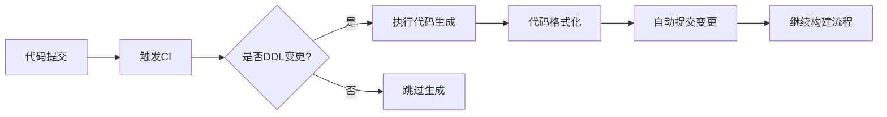

# 代码生成器扩展开发手册

## 一、模板语法手册（Handlebars进阶版）

### 1.1 基础模板变量

```handlebars
{{! 表名转大驼峰 }}
{{pascalCase tableName}} → UserInfo

{{! 表名转中划线 }}
{{kebabCase tableName}} → user-info

{{! 字段名转小驼峰 }}
{{camelCase columnName}} → createdAt
```

### 1.2 条件控制语句

```handlebars
{{#if (eq column.tsType 'string')}}
@IsString()
{{/if}}

{{#if column.isPrimary}}
@PrimaryGeneratedColumn()
{{else}}
@Column()
{{/if}}
```

### 1.3 循环语句增强

```handlebars
{{#each columns as |col index|}}
{{#unless col.isPrimary}} {{! 排除主键字段 }}
@ApiProperty({ description: '{{col.comment}}' })
{{/unless}}
{{/each}}
```

### 1.4 自定义Helper函数

```javascript
// 注册自定义helper
Handlebars.registerHelper('typeDecorator', function(type) {
  const decorators = {
    string: '@IsString()',
    number: '@IsNumber()',
    boolean: '@IsBoolean()'
  };
  return new Handlebars.SafeString(decorators[type] || '');
});

// 模板中使用
{{typeDecorator column.tsType}}
```

### 1.5 局部模板引入

```handlebars
{{! 引入通用头部 }}
{{> common/header }}

{{! 引入字段遍历模板 }}
{{#each columns}}
  {{> field }}
{{/each}}
```

---

## 二、模板调试指南

### 2.1 调试模式启动

```bash
DEBUG=gen:* gen-code --table users --dry-run
```

### 2.2 调试信息解读

```log
GEN:META 解析表结构成功 +3ms
  TableMeta {
    tableName: 'sys_user',
    columns: [
      ColumnMeta { name: 'user_id', type: 'bigint'... }
    ]
  }
GEN:TEMPLATE 应用模板 entity.hbs +12ms
GEN:OUTPUT 生成文件路径: src/entities/SysUser.entity.ts +5ms
```

### 2.3 实时预览工具

```javascript
// 启动实时预览服务器
gen-code preview --port 3000

// 浏览器访问
http://localhost:3000/preview?template=entity&table=users
```

---

## 三、CI/CD集成方案

### 3.1 代码生成流水线设计



### 3.2 GitLab CI配置示例

```yaml
stages:
  - generate
  - build

codegen:
  stage: generate
  image: node:16
  script:
    - npm install -g @gen/cli
    - gen-code auto --config .genrc.yml
    - git config --global user.email "ci@example.com"
    - git config --global user.name "CI Bot"
    - git add .
    - git commit -m "Auto-generated code" || echo "No changes"
  only:
    changes:
      - "database/migrations/*.sql"

build:
  stage: build
  needs: ["codegen"]
  script:
    - npm install
    - npm run build
```

### 3.3 变更检测机制

```bash
# 检测SQL文件变更
git diff --name-only HEAD^ HEAD | grep 'migrations/.*\.sql'

# 检测表结构变化
gen-code detect-changes --prev-schema schema.json --current-schema new-schema.json
```

---

## 四、模板开发工作流

### 4.1 开发环境搭建

```bash
# 克隆模板仓库
git clone https://github.com/yourorg/gen-templates.git

# 安装依赖
npm install -g @gen/cli handlebars live-server

# 启动开发服务器
gen-code dev --watch
```

### 4.2 模板单元测试

```typescript
// 测试字段类型转换
test('mysql类型映射', () => {
  const meta = parseColumn('age', 'int', '年龄');
  expect(meta.tsType).toBe('number');
});

// 测试模板渲染
test('生成实体类', async () => {
  const code = await renderTemplate('entity.hbs', userTableMeta);
  expect(code).toContain('@PrimaryGeneratedColumn()');
});
```

### 4.3 版本管理策略

```markdown
- 模板版本命名规则：`主版本.模板类型.迭代号`
  示例：`v2.antd.12`
- 版本兼容性矩阵：

| 生成器版本 | 模板版本范围 |
|------------|---------------|
| 1.x        | 1.0.x ~ 1.2.x |
| 2.x        | 2.0.x+        |
```

---

## 五、高级模板示例

### 5.1 生成GraphQL层

```handlebars
// graphql.hbs
type {{pascalCase tableName}} {
  {{#each columns}}
  {{camelCase name}}: {{graphqlType this}} {{! 自定义类型转换 }}
  {{/each}}
}

input Create{{pascalCase tableName}}Input {
  {{#each nonPkColumns}}
  {{camelCase name}}: {{graphqlType this}}
  {{/each}}
}
```

### 5.2 生成TypeScript类型声明

```handlebars
// types.hbs
export interface I{{pascalCase tableName}} {
  {{#each columns}}
  {{camelCase name}}: {{tsType this}};
  {{/each}}
}

export type T{{pascalCase tableName}}Keys = {{#each columns}}
  | '{{camelCase name}}'{{/each}};
```

---

## 六、安全规范

### 6.1 沙箱执行策略

```typescript
// 安全执行模板
import { runInNewContext } from 'vm';

const safeTemplate = (code: string, context: object) => {
  return runInNewContext(code, context, {
    timeout: 1000,
    microtaskMode: 'afterEvaluate'
  });
};
```

### 6.2 敏感数据处理

```javascript
// 加密数据库凭据
const encrypted = crypto.createCipheriv('aes-256-cbc', key, iv);
let encryptedPassword = encrypted.update(password, 'utf8', 'hex');
encryptedPassword += encrypted.final('hex');

// 内存中仅保留加密后数据
process.env.DB_PASSWORD = encryptedPassword;
```

---

## 七、性能优化方案

### 7.1 缓存策略实现

```typescript
// 模板编译缓存
const templateCache = new Map();

function compileTemplate(tplPath: string) {
  if (templateCache.has(tplPath)) {
    return templateCache.get(tplPath);
  }

  const compiled = Handlebars.compile(fs.readFileSync(tplPath, 'utf8'));
  templateCache.set(tplPath, compiled);

  return compiled;
}
```

### 7.2 并行生成优化

```javascript
// 使用Worker Threads并行处理
const { Worker } = require('worker_threads');

async function generateInParallel(tables) {
  return Promise.all(tables.map(table =>
    new Promise((resolve, reject) => {
      const worker = new Worker('./generator-worker.js', {
        workerData: { table }
      });
      worker.on('message', resolve);
      worker.on('error', reject);
    })
  ));
}
```

---

## 八、异常处理机制

### 8.1 错误分类处理

```typescript
enum GenError {
  // 数据库错误
  DB_CONNECTION_FAILED = 1001,
  TABLE_NOT_FOUND = 1002,

  // 模板错误
  TEMPLATE_SYNTAX_ERROR = 2001,
  VARIABLE_UNDEFINED = 2002,

  // 文件系统错误
  WRITE_PERMISSION_DENIED = 3001
}

// 错误处理中间件
app.use((err, req, res, next) => {
  if (err.code in GenError) {
    res.status(400).json({ error: GenError[err.code] });
  } else {
    next(err);
  }
});
```

---

## 九、扩展开发示例

### 9.1 生成OpenAPI文档

```handlebars
{{! controller.hbs部分模板 }}
@ApiOperation({ summary: '创建{{tableComment}}' })
@Post()
async create(@Body() dto: Create{{pascalCase tableName}}Dto) {
  // ...
}
```

### 9.2 生成单元测试

```handlebars
// service.spec.hbs
describe('{{pascalCase tableName}}Service', () => {
  let service: {{pascalCase tableName}}Service;

  beforeEach(async () => {
    const module = await Test.createTestingModule({
      providers: [
        {{pascalCase tableName}}Service,
        { provide: getRepositoryToken({{pascalCase tableName}}), useValue: mockRepository }
      ]
    }).compile();

    service = module.get<{{pascalCase tableName}}Service>({{pascalCase tableName}}Service);
  });

  it('应正确创建记录', async () => {
    // 测试逻辑
  });
});
```

---

## 十、监控与日志

### 10.1 生成指标采集

```typescript
// 监控生成性能
const generateHistogram = new prometheus.Histogram({
  name: 'codegen_duration_seconds',
  help: '代码生成耗时统计',
  labelNames: ['table'],
  buckets: [0.1, 0.5, 1, 2, 5]
});

async function generateWithMetrics(table) {
  const end = generateHistogram.startTimer({ table });
  await generateCode(table);
  end();
}
```

### 10.2 日志规范

```log
[2023-08-20T10:00:00Z] INFO: 开始生成用户表代码
字段数: 15 | 模板: default
[2023-08-20T10:00:03Z] SUCCESS: 生成完成 耗时2.3s
输出文件:
  - src/entities/User.entity.ts
  - src/services/user.service.ts
```

---

**集成验证清单**：

1. [ ] 在本地运行`gen-code check-env`验证环境配置
1. [ ] 执行端到端测试：`npm run test:e2e`
1. [ ] 验证生成的代码通过ESLint检查
1. [ ] 确认CI流水线能正确处理自动生成提交
1. [ ] 测试回滚机制：`gen-code rollback --version 1.0.2`
