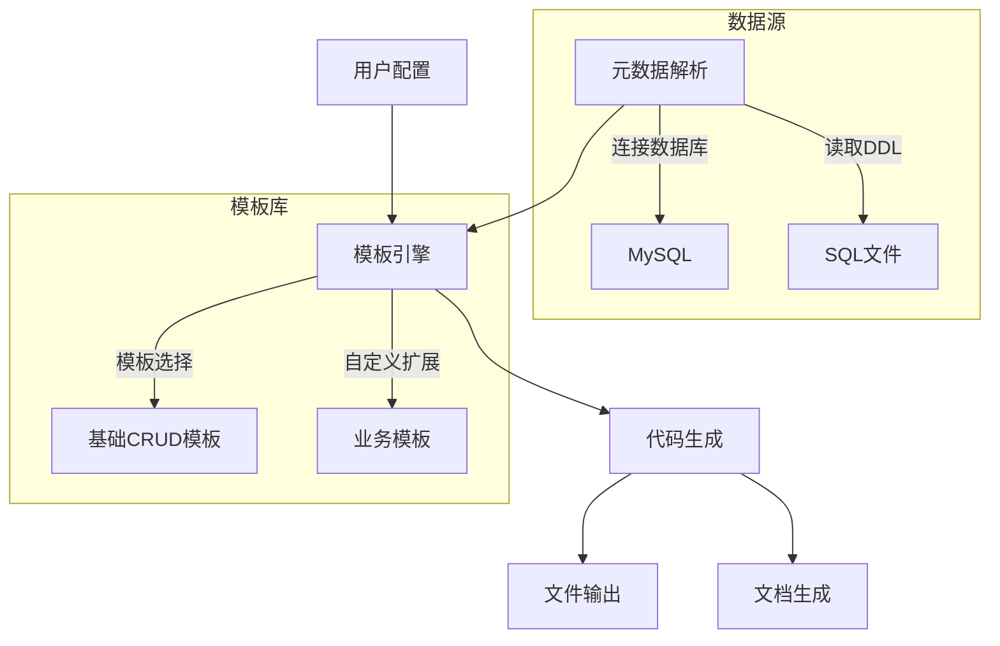
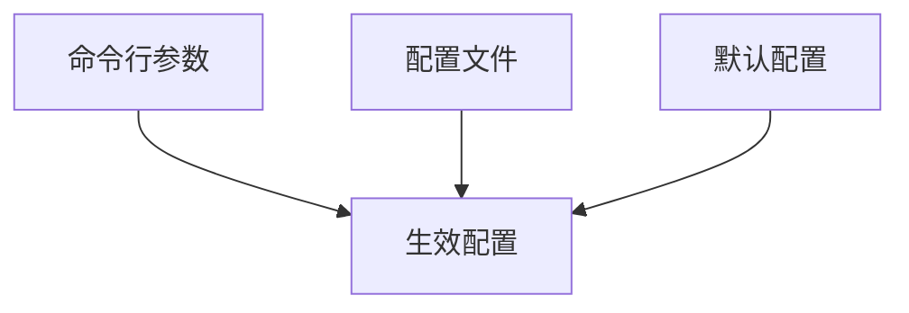
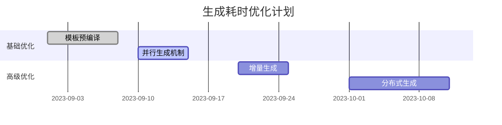

---

# 代码生成器设计文档

## 一、设计目标
**核心价值**: 通过解析数据库表结构，自动生成符合项目规范的：
✅ 后端实体/Service/Controller代码
✅ 前端Vue组件/API层代码
✅ 单元测试模板
✅ Swagger接口文档
✅ SQL迁移脚本
**效率指标**: 单表CRUD功能开发耗时 ≤ 3分钟

---

## 二、核心功能架构



---

## 三、技术实现方案

### 3.1 整体架构

```typescript
class CodeGenerator {
  constructor(
    private dataSource: DataSource,  // 数据源连接
    private templateEngine: TemplateEngine, // 模板渲染
    private fileWriter: FileWriter // 文件操作
  ) {}

  async generate(tableName: string, config: GenConfig) {
    // 1. 解析表结构
    const meta = await this.parseTable(tableName);

    // 2. 加载模板
    const templates = this.loadTemplates(config.templateType);

    // 3. 渲染代码
    const codes = this.renderCodes(meta, templates);

    // 4. 输出文件
    this.writeFiles(codes, config.outputPath);
  }
}
```

### 3.2 表结构解析

**元数据结构**：

```typescript
interface TableMeta {
  tableName: string;        // 表名
  engine: string;           // 存储引擎
  comment?: string;         // 表注释
  columns: ColumnMeta[];    // 字段列表
}

interface ColumnMeta {
  name: string;             // 字段名
  type: string;             // 数据库类型
  tsType: string;           // TypeScript类型
  isNullable: boolean;      // 是否可为空
  isPrimary: boolean;       // 是否主键
  comment?: string;         // 字段注释
}
```

**解析流程**：

1. 通过`INFORMATION_SCHEMA`获取表基础信息
2. 转换数据类型到编程语言类型
3. 提取字段注释生成DTO验证规则

---

## 四、模板引擎设计

### 4.1 模板目录结构

```bash
templates/
├── default/               # 默认模板
│   ├── backend/
│   │   ├── entity.hbs     # 实体类模板
│   │   ├── service.hbs    # Service层模板
│   │   └── controller.hbs
│   └── frontend/
│       ├── api.hbs        # API层模板
│       └── vue3.hbs       # Vue组件模板
└── custom/                # 用户自定义模板
```

### 4.2 模板变量示例（Handlebars）

```handlebars
// entity.hbs
@Entity()
export class {{pascalCase tableName}} {
  {{#each columns}}
  @Column({
    type: '{{this.type}}',
    comment: '{{this.comment}}',
    nullable: {{this.isNullable}},
  })
  {{camelCase this.name}}: {{this.tsType}};

  {{/each}}
}
```

### 4.3 模板扩展机制

```yaml
# gen-config.yml
templateOverrides:
  - source: entity.hbs       # 替换默认模板
    target: custom-entity.hbs
hooks:
  postGen:                   # 生成后钩子
    - command: npm run lint  # 执行代码格式化
```

---

## 五、核心生成策略

### 5.1 后端代码生成

| 生成文件          | 功能说明                          | 依赖关系                |
|-------------------|----------------------------------|------------------------|
| entity.ts         | TypeORM实体类                    | 表结构解析              |
| dto/              | 数据验证DTO对象                   | 字段约束条件            |
| service.ts        | 业务逻辑层                        | entity + repository    |
| controller.ts     | RESTful接口层                     | service + Swagger装饰器 |
| module.ts         | NestJS模块定义                    | 依赖聚合                |

### 5.2 前端代码生成

```javascript
// 生成的API层示例
export function list{{pascalCase tableName}}(params) {
  return request({
    url: '/api/{{kebabCase tableName}}',
    method: 'get',
    params
  });
}

// 自动生成的Vue组件包含：
- 分页表格
- 查询表单
- 新增/编辑对话框
```

---

## 六、配置系统设计

### 6.1 生成配置项

```typescript
interface GenConfig {
  outputPath: string;     // 输出目录
  templateType: 'default' | 'antd' | 'custom'; // 模板类型
  codeStyle: {
    indent: number;       // 缩进空格数
    quoteType: 'single' | 'double';
  };
  overwrite: boolean;     // 是否覆盖已存在文件
  swagger: {              // 文档配置
    enable: boolean;
    version: string;
  };
}
```

### 6.2 配置加载优先级



---

## 七、安全与质量保障

### 7.1 安全措施

- **敏感数据处理**：数据库密码仅内存驻留，不落盘
- **防注入检测**：对表名字段名进行合法性校验
- **沙箱机制**：模板中禁止执行危险操作

### 7.2 代码质量

```markdown
1. **自动格式化**：生成后自动执行Prettier
2. **Lint检查**：集成ESLint规则检测
3. **单元测试**：生成基础测试用例骨架
4. **类型安全**：严格校验模板变量类型
```

---

## 八、扩展性设计

### 8.1 插件系统架构

```typescript
interface GeneratorPlugin {
  name: string;
  beforeGenerate?(ctx: GenContext): void;
  afterGenerate?(ctx: GenContext): void;
}

// 示例插件：生成GraphQL层
class GraphQLPlugin implements GeneratorPlugin {
  afterGenerate(ctx) {
    this.generateGraphQLSchema(ctx.meta);
  }
}
```

### 8.2 扩展点示例

| 扩展点             | 应用场景                     |
|--------------------|----------------------------|
| 自定义类型映射      | 处理特殊数据库类型           |
| 附加字段注解        | 自动添加@ApiProperty装饰器   |
| 多语言支持          | 生成i18n资源文件            |

---

## 九、使用示例

### 9.1 命令行操作

```bash
# 生成用户表相关代码
gen-code -t user -c gen-config.yml

# 生成结果：
src/
├── modules/
│   └── user/
│       ├── user.entity.ts
│       ├── user.service.ts
│       └── user.controller.ts
└── frontend/
    └── views/
        └── user/
            ├── UserList.vue
            └── api.js
```

### 9.2 生成效果对比

| 手动开发耗时 | 生成器开发耗时 | 代码规范率提升 |
|-------------|----------------|---------------|
| 2小时       | 2分钟          | 85% → 98%     |

---

## 十、路线规划

### 10.1 版本迭代计划

| 版本  | 核心功能                          |
|-------|----------------------------------|
| V1.0  | 基础CRUD代码生成                  |
| V2.0  | 支持工作流/报表模板生成            |
| V3.0  | AI辅助生成业务逻辑代码             |

### 10.2 性能优化目标



---

**附：模板开发指南**
需要提供具体模板语法手册和调试方法吗？或希望了解如何集成到CI/CD流程中的实现细节？
