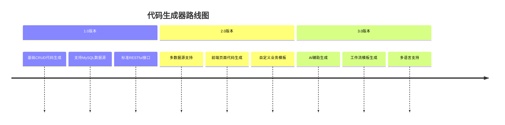

# 代码生成器用户手册

## 一、概述

### 产品定位

代码生成器是一款高效的开发辅助工具，旨在通过解析数据库表结构，自动生成符合项目规范的各层代码，显著提升开发效率，降低重复工作量。

### 核心价值

- **提效增速**：将单表CRUD功能开发时间从小时级缩减至分钟级
- **规范统一**：确保生成的代码100%符合项目编码规范
- **降低门槛**：让非专业开发人员也能快速生成高质量代码

## 二、用户指南

### 2.1 前置条件

- 已有数据库表结构（MySQL）
- 已安装Node.js环境（v14+）
- 已配置项目环境变量

### 2.2 使用步骤

#### 方式一：命令行操作

```bash
# 基础用法
npm run gen:code --table=user_profile

# 高级用法（指定模板与输出路径）
npm run gen:code --table=product --template=business --output=src/modules/shop
```

#### 方式二：可视化界面

1. 启动可视化界面：`npm run gen:ui`
2. 访问：`http://localhost:4000/generator`
3. 按界面提示操作：
   - 选择数据源
   - 选择目标表
   - 配置生成选项
   - 点击"生成代码"

### 2.3 配置说明

在项目根目录创建`generator.config.js`文件：

```javascript
module.exports = {
  // 数据源配置
  dataSource: {
    type: 'mysql',
    host: 'localhost',
    port: 3306,
    username: 'root',
    password: 'password',
    database: 'admin_flow'
  },

  // 代码生成配置
  generator: {
    // 默认输出路径
    outputPath: 'src/modules',

    // 默认模板
    templateType: 'default',

    // 代码风格
    codeStyle: {
      indent: 2,
      quoteType: 'single'
    },

    // 是否覆盖已存在文件
    overwrite: false,

    // Swagger文档配置
    swagger: {
      enable: true,
      version: '1.0'
    },

    // 生成内容选择
    generates: {
      entity: true,
      dto: true,
      controller: true,
      service: true,
      module: true,
      test: true
    }
  }
};
```

### 2.4 注解规则

通过表和字段的注释定义特殊生成规则：

| 注解语法 | 位置 | 功能说明 | 示例 |
|---------|------|---------|------|
| @ignore | 字段注释 | 生成代码时忽略该字段 | `created_at datetime COMMENT '@ignore 创建时间'` |
| @enum(key:value) | 字段注释 | 定义枚举类型 | `status tinyint COMMENT '@enum(0:禁用,1:启用) 状态'` |
| @relation(entity) | 字段注释 | 定义关联关系 | `user_id int COMMENT '@relation(User) 用户ID'` |
| @swagger-group | 表注释 | 定义Swagger分组 | `CREATE TABLE users COMMENT '@swagger-group(用户管理) 用户表'` |

## 三、生成内容说明

### 3.1 后端代码

| 生成文件 | 文件位置 | 功能说明 |
|--------|---------|---------|
| Entity类 | src/modules/{name}/{name}.entity.ts | 数据实体映射 |
| DTO类 | src/modules/{name}/dto/ | 数据传输对象 |
| Controller | src/modules/{name}/{name}.controller.ts | RESTful接口 |
| Service | src/modules/{name}/{name}.service.ts | 业务逻辑 |
| Module | src/modules/{name}/{name}.module.ts | 模块定义 |
| 单元测试 | test/modules/{name}/ | 测试用例 |

#### Entity示例

```typescript
@Entity()
export class UserProfile {
  @PrimaryGeneratedColumn()
  id: number;

  @Column({
    type: 'varchar',
    length: 50,
    comment: '用户名',
  })
  username: string;

  @Column({
    type: 'tinyint',
    comment: '状态',
    default: 1,
  })
  @ApiProperty({
    enum: [0, 1],
    description: '状态(0:禁用,1:启用)',
  })
  status: number;
}
```

### 3.2 接口文档

自动生成的Swagger文档，访问路径：`/api/docs`

## 四、开发者指南

### 4.1 自定义模板

模板位置：`scripts/generator/templates/`

```
templates/
├── default/               # 默认模板
│   ├── entity.hbs         # 实体类模板
│   ├── service.hbs        # Service层模板
│   └── ...
├── business/              # 业务模板
│   └── ...
└── custom/                # 自定义模板
```

#### 模板语法

使用Handlebars模板引擎，主要变量：

- `tableName`: 表名
- `className`: 类名(PascalCase)
- `instanceName`: 实例名(camelCase)
- `apiResource`: API资源名(kebab-case)
- `columns`: 字段列表
  - `name`: 字段名
  - `type`: 数据库类型
  - `tsType`: TypeScript类型
  - `comment`: 注释
  - `isPrimary`: 是否主键
  - `isNullable`: 是否可空

#### 辅助函数

- `pascalCase`: 转换为PascalCase
- `camelCase`: 转换为camelCase
- `kebabCase`: 转换为kebab-case
- `snakeCase`: 转换为snake_case

### 4.2 自定义生成策略

扩展生成器核心类：`scripts/generator/src/CodeGenerator.ts`

```typescript
// 自定义字段类型映射
export class CustomTypeMapper extends BaseTypeMapper {
  mapToTsType(dbType: string): string {
    if (dbType === 'json') return 'Record<string, any>';
    return super.mapToTsType(dbType);
  }
}

// 注册自定义映射器
codeGenerator.registerTypeMapper(new CustomTypeMapper());
```

### 4.3 插件开发

```typescript
import { GeneratorPlugin, GenContext } from '../types';

// 自动添加日志插件
export class LoggerPlugin implements GeneratorPlugin {
  name = 'LoggerPlugin';

  // 生成前钩子
  beforeGenerate(ctx: GenContext): void {
    console.log(`开始生成表 ${ctx.meta.tableName} 的代码`);
  }

  // 生成后钩子
  afterGenerate(ctx: GenContext): void {
    // 自动添加日志记录代码
    ctx.files.forEach(file => {
      if (file.type === 'service') {
        file.content = `import { Logger } from '@nestjs/common';\n${file.content}`;
        file.content = file.content.replace(
          'export class',
          'export class',
          'private readonly logger = new Logger(this.constructor.name);\n'
        );
      }
    });
  }
}

// 注册插件
codeGenerator.registerPlugin(new LoggerPlugin());
```

## 五、常见问题

### 5.1 问题排查

| 问题描述 | 可能原因 | 解决方案 |
|---------|---------|---------|
| 连接数据库失败 | 配置错误 | 检查generator.config.js中的数据库配置 |
| 生成代码包含错误 | 模板语法错误 | 检查自定义模板语法 |
| 字段类型映射不正确 | 特殊数据库类型 | 添加自定义类型映射器 |
| 文件已存在无法覆盖 | 安全保护机制 | 使用--overwrite参数或配置overwrite:true |

### 5.2 最佳实践

1. **定义完整的表注释**：通过规范的注释提供更多元数据
2. **遵循命名规范**：表名使用下划线命名法，便于转换
3. **增量生成**：先生成基础代码，再自定义扩展
4. **避免直接修改生成代码**：通过扩展或装饰模式添加自定义逻辑

## 六、扩展计划



## 七、贡献指南

欢迎提交PR优化代码生成器功能：

1. Fork项目仓库
2. 创建功能分支
3. 提交变更代码
4. 创建Pull Request

## 附录：配置参考

### 完整配置示例

```javascript
module.exports = {
  // 数据源配置（详细）
  dataSource: {
    type: 'mysql',
    host: 'localhost',
    port: 3306,
    username: 'root',
    password: 'password',
    database: 'admin_flow',
    synchronize: false,
    logging: false,
    connectTimeout: 20000
  },

  // 生成器配置（详细）
  generator: {
    // 输出配置
    outputPath: 'src/modules',
    overwrite: false,

    // 模板配置
    templatePath: 'scripts/generator/templates',
    templateType: 'default',

    // 命名配置
    naming: {
      entity: '{Name}Entity',
      service: '{Name}Service',
      controller: '{Name}Controller'
    },

    // 代码风格
    codeStyle: {
      indent: 2,
      quoteType: 'single',
      semicolons: true
    },

    // Swagger配置
    swagger: {
      enable: true,
      version: '1.0',
      description: 'API文档',
      contact: {
        name: 'Admin Team',
        email: 'admin@example.com'
      }
    },

    // 生成内容
    generates: {
      entity: true,
      dto: {
        create: true,
        update: true,
        filter: true
      },
      controller: true,
      service: true,
      module: true,
      test: true,
      mock: false
    },

    // 高级配置
    skipFields: ['created_at', 'updated_at', 'deleted_at'],
    customTypeMap: {
      'tinyint(1)': 'boolean'
    },
    plugins: ['LoggerPlugin']
  }
};
```
