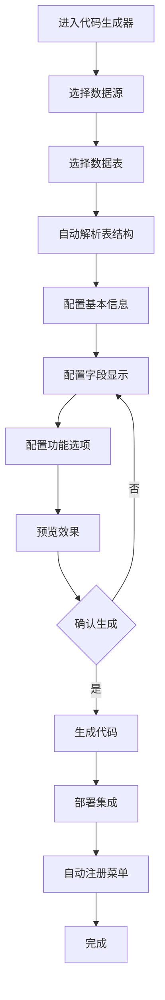

# 代码生成器前端功能设计

## 一、产品定位

代码生成器是AdminFlow平台中的核心功能，面向非技术人员设计，通过可视化配置即可生成完整的前后端功能模块，无需编写任何代码。

## 二、用户界面设计

### 2.1 总体布局

采用清晰的三栏布局，确保用户操作流程直观清晰：

```
+-------------------------------------------------------+
|                     头部导航栏                         |
+----------+-----------------------------+--------------+
|          |                             |              |
|  左侧    |        中间配置区           |   右侧      |
|  步骤    |                             |   预览区    |
|  导航    |                             |              |
|          |                             |              |
|          |                             |              |
+----------+-----------------------------+--------------+
|                     底部操作栏                         |
+-------------------------------------------------------+
```

### 2.2 关键页面设计

#### 2.2.1 主界面


主界面提供功能概览和快速入口：

- 最近生成的模块列表
- 快速创建按钮
- 模板库入口
- 常用配置入口
- 帮助指南入口

#### 2.2.2 数据源配置界面


用户选择和配置数据来源：

- 数据库连接选择器
- 表结构选择器
- 表结构可视化展示
- 字段信息预览
- 字段筛选器

#### 2.2.3 功能配置界面


核心配置界面，用户定义生成功能的各项参数：

- 模块基本信息（名称、图标、路径）
- 页面布局选择（列表样式、表单样式）
- 字段展示配置（列表字段、查询字段、表单字段）
- 按钮与操作配置
- 高级功能配置（导入导出、批量操作）

#### 2.2.4 预览界面


实时预览配置效果：

- 列表页预览
- 表单页预览
- 详情页预览
- 移动端预览切换
- 主题切换预览

## 三、用户操作流程

### 3.1 基础生成流程

基础流程设计为引导式，确保新用户也能轻松完成：



### 3.2 详细步骤说明

1. **选择数据源**
   - 从已配置的数据源列表中选择
   - 或临时配置新数据源连接

2. **选择数据表**
   - 浏览数据库表列表
   - 可搜索、筛选表名
   - 预览表基本信息

3. **基本信息配置**
   - 模块名称（用于生成代码和菜单）
   - 模块描述（用于注释和文档）
   - 模块图标选择
   - 模块分类与菜单位置

4. **字段配置**
   - 拖拽调整字段顺序
   - 配置每个字段的展示规则
   - 设置字段控件类型
   - 配置字段验证规则

5. **功能配置**
   - 选择模块功能（增删改查、导入导出）
   - 选择页面布局模板
   - 配置权限要求
   - 设置高级选项（批量操作、审计记录）

6. **预览确认**
   - 实时预览生成效果
   - 模拟数据交互
   - 响应式布局预览
   - 修改配置实时更新预览

7. **生成部署**
   - 确认生成代码
   - 显示生成进度
   - 部署完成通知
   - 提供快速访问链接

## 四、关键功能设计

### 4.1 智能表单构建器


- 拖拽式字段排列
- 组件智能推荐
- 表单布局设计（分栏、分组、标签位置）
- 表单联动规则配置
- 表单校验规则配置

### 4.2 表格设计器


- 列配置（宽度、对齐方式、格式化）
- 操作列定制
- 批量操作按钮配置
- 列筛选与排序配置
- 表格样式选择

### 4.3 高级查询构建器


- 条件组合构建
- 查询方式选择（等于、包含、范围）
- 默认值配置
- 查询控件选择
- 字段联动设置

### 4.4 模板管理


- 模板分类浏览
- 模板预览
- 模板参数配置
- 自定义模板上传
- 模板导入导出

## 五、交互细节设计

### 5.1 拖拽交互

- 支持拖拽调整字段顺序
- 拖拽从可选字段到已选字段
- 拖拽调整表单布局
- 拖拽组织表格列

### 5.2 实时预览

- 配置变更即时反映到预览区
- 支持预览区域大小调整
- 支持多设备尺寸切换
- 支持预览区域全屏查看

### 5.3 智能提示

- 字段类型智能推荐对应控件
- 常用配置智能提示
- 错误配置自动检测提示
- 最佳实践建议提示

## 六、技术实现要点

### 6.1 前端架构

- 基于Vue3组件化开发
- 状态管理使用Pinia
- 响应式设计确保多设备适配
- 组件懒加载提升性能

### 6.2 关键技术点

- 动态渲染引擎：实现配置到界面的实时渲染
- 配置序列化：确保配置可保存和恢复
- 拖拽交互：基于Vue Draggable实现
- 预览引擎：使用iframe隔离运行预览代码

## 七、扩展性设计

### 7.1 模板扩展机制

- 支持自定义页面模板
- 模板参数自定义
- 模板市场集成
- 模板版本管理

### 7.2 组件扩展机制

- 自定义控件注册
- 控件属性配置界面
- 控件映射规则配置
- 第三方组件库集成

### 7.3 主题定制

- 支持多套UI主题
- 主题参数配置
- 主题实时预览
- 主题导入导出

## 八、用户体验优化

### 8.1 易用性提升

- 新手引导教程
- 上下文帮助提示
- 智能默认值
- 常见问题快速解答

### 8.2 效率提升

- 配置模板保存与复用
- 批量操作支持
- 快捷键支持
- 最近操作记录

### 8.3 容错设计

- 自动保存机制
- 操作撤销/重做
- 配置验证与错误提示
- 异常恢复机制

## 九、UI组件库

### 9.1 基础组件

为代码生成器提供的专用组件集：

- 字段选择器
- 控件映射配置器
- 布局设计器
- 预览渲染器
- 代码查看器

### 9.2 高级组件

针对特定场景的专用组件：

- 关系图谱展示器
- 字段依赖配置器
- 数据流向可视化
- 模板参数编辑器
- 自定义函数编辑器

## 十、产品路线规划

### 10.1 V1.0版本

- 基础表单生成
- 标准列表生成
- 简单查询配置
- 基本字段映射
- 系统集成

### 10.2 V2.0版本

- 高级表单构建
- 复杂查询构建
- 自定义模板支持
- 批量操作配置
- 数据校验规则

### 10.3 V3.0版本

- 工作流集成
- 报表设计器
- AI智能推荐
- 可视化大屏设计
- 移动端应用生成
