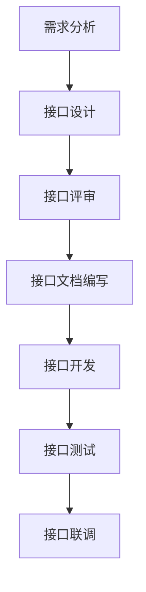
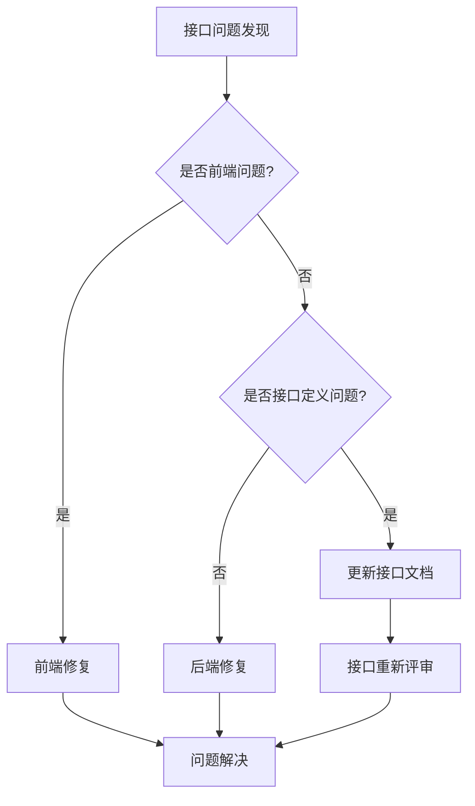
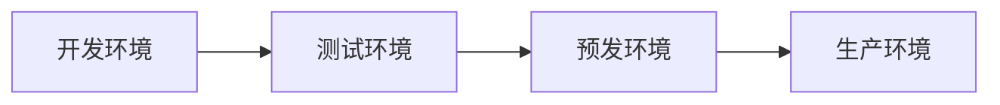

# 前后端对接规范

## 一、概述

本文档规定了前后端分离开发模式下，前端与后端开发团队的协作规范，包括接口设计、数据交互、开发流程等方面的标准与约定。

## 二、接口规范

### 2.1 接口URL规范

1. **基础路径**：所有API统一使用`/api/v1`作为基础路径
2. **资源命名**：使用复数名词，例如`/api/v1/users`
3. **层级嵌套**：最多不超过3级，例如`/api/v1/departments/{deptId}/users`
4. **版本控制**：在URL中体现版本号，如v1, v2
5. **参数传递**：
   - GET请求：参数通过QueryString传递
   - POST/PUT/PATCH请求：参数通过RequestBody传递
   - 路径参数：使用`{paramName}`形式

### 2.2 HTTP方法使用规范

| 方法   | 使用场景               | 示例                             |
|--------|-----------------------|----------------------------------|
| GET    | 获取资源               | GET /api/v1/users                |
| POST   | 创建资源               | POST /api/v1/users               |
| PUT    | 全量更新资源           | PUT /api/v1/users/1              |
| PATCH  | 部分更新资源           | PATCH /api/v1/users/1            |
| DELETE | 删除资源               | DELETE /api/v1/users/1           |

### 2.3 响应状态码规范

| 状态码 | 含义                      | 使用场景                        |
|--------|--------------------------|----------------------------------|
| 200    | 成功                     | 请求成功处理                     |
| 201    | 已创建                   | 资源创建成功                     |
| 204    | 无内容                   | 删除成功等无需返回内容的场景     |
| 400    | 请求错误                 | 参数验证失败等客户端错误         |
| 401    | 未授权                   | 未登录或token无效                |
| 403    | 禁止访问                 | 权限不足                         |
| 404    | 资源不存在               | 请求的资源不存在                 |
| 409    | 资源冲突                 | 唯一性冲突等情况                 |
| 429    | 请求过于频繁             | 超出限流阈值                     |
| 500    | 服务器错误               | 服务器内部异常                   |

### 2.4 响应数据结构规范

```json
// 成功响应
{
  "code": 200,
  "message": "success",
  "data": {
    // 业务数据
  },
  "timestamp": 1634567890123
}

// 分页数据
{
  "code": 200,
  "message": "success",
  "data": {
    "list": [
      // 数据项列表
    ],
    "total": 100,
    "page": 1,
    "pageSize": 10
  },
  "timestamp": 1634567890123
}

// 错误响应
{
  "code": 40001,
  "message": "参数验证失败",
  "details": [
    {
      "field": "username",
      "message": "用户名不能为空"
    }
  ],
  "path": "/api/v1/users",
  "timestamp": 1634567890123
}
```

## 三、协作流程

### 3.1 接口设计流程



### 3.2 接口文档规范

1. **文档工具**：使用Swagger/OpenAPI进行接口文档管理
2. **文档内容**：
   - 接口名称与描述
   - 请求URL与方法
   - 请求参数与类型
   - 响应数据与类型
   - 错误码说明
   - 请求示例与响应示例

### 3.3 接口变更流程

1. **提出变更**：说明变更原因和影响范围
2. **评审变更**：前后端开发人员共同评审
3. **更新文档**：更新接口文档
4. **实施变更**：后端实现变更
5. **通知前端**：变更完成后通知前端
6. **联合测试**：共同验证变更是否符合预期

## 四、数据交互规范

### 4.1 数据类型映射

| 后端类型(Java) | 前端类型(TypeScript) | 说明                 |
|----------------|---------------------|----------------------|
| Integer/Long   | number              | 整数类型             |
| Float/Double   | number              | 浮点类型             |
| String         | string              | 字符串类型           |
| Boolean        | boolean             | 布尔类型             |
| LocalDate      | string              | 日期(YYYY-MM-DD)     |
| LocalDateTime  | string              | 日期时间(ISO 8601)   |
| List           | array               | 数组                 |
| Map/Object     | object              | 对象                 |
| Enum           | string/number       | 枚举值               |

### 4.2 前端数据处理规范

1. **时间日期处理**：
   - 接收：后端返回ISO 8601格式
   - 显示：根据需求格式化显示
   - 提交：ISO 8601格式提交

2. **数值处理**：
   - 金额：保留2位小数
   - 百分比：前端处理显示百分号
   - 大数值：使用字符串传输，前端处理显示

3. **枚举值处理**：
   - 后端返回编码
   - 前端维护编码与显示值的映射关系

### 4.3 空值处理规范

1. **前端提交**：
   - 字符串：空字符串("")或不提交该字段
   - 数值：null或不提交该字段
   - 对象：null或不提交该字段
   - 数组：空数组([])或不提交该字段

2. **后端返回**：
   - 字符串：空字符串("")或null
   - 数值：null
   - 对象：null
   - 数组：空数组([])

## 五、权限控制

### 5.1 前后端权限协作

1. **权限模型**：基于RBAC(角色-权限)模型
2. **权限控制点**：
   - 后端：接口访问权限控制
   - 前端：界面元素显示控制

3. **权限信息获取**：
   - 登录后获取用户权限列表
   - 权限列表包含：角色和操作权限标识

4. **权限标识定义**：
   - 格式：`模块:资源:操作`
   - 示例：`system:user:create`、`system:role:update`

### 5.2 权限接口规范

```json
// 获取用户权限接口响应
{
  "code": 200,
  "message": "success",
  "data": {
    "user": {
      "id": 1,
      "username": "admin",
      "nickname": "管理员"
    },
    "roles": ["admin", "manager"],
    "permissions": [
      "system:user:list",
      "system:user:create",
      "system:user:update",
      "system:user:delete"
    ]
  }
}
```

## 六、API开发流程与测试

### 6.1 API开发流程

1. **接口设计**：前后端共同参与设计
2. **接口文档**：后端开发人员编写Swagger文档
3. **接口Mock**：前端基于文档创建Mock数据
4. **后端开发**：后端并行开发接口
5. **联合调试**：前后端联合调试接口
6. **接口测试**：确保接口功能符合预期

### 6.2 API测试规范

1. **单元测试**：后端开发人员编写单元测试
2. **集成测试**：测试人员编写接口测试用例
3. **前端测试**：前端开发人员进行接口联调测试
4. **性能测试**：针对高并发接口进行性能测试

### 6.3 常见问题解决流程



## 七、版本控制与兼容性

### 7.1 版本控制规范

1. **版本号定义**：采用语义化版本号(SemVer)
   - 格式：Major.Minor.Patch
   - 主版本号(Major)：不兼容的API变更
   - 次版本号(Minor)：向下兼容的功能新增
   - 修订号(Patch)：向下兼容的问题修复

2. **API版本控制**：
   - URL路径版本：`/api/v1/users`、`/api/v2/users`
   - 所有不兼容的变更必须使用新版本号

### 7.2 兼容性处理规范

1. **字段新增**：
   - 后端：新增字段可选，提供默认值
   - 前端：做好容错处理

2. **字段删除**：
   - 先标记为废弃(deprecated)
   - 在下一个主版本中移除

3. **字段重命名**：
   - 先保留旧字段并标记为废弃
   - 同时提供新字段
   - 在下一个主版本中移除旧字段

4. **接口参数变更**：
   - 参数新增：设为可选参数
   - 参数删除：标记为废弃，保持兼容

## 八、安全规范

### 8.1 认证与授权

1. **认证方式**：JWT(JSON Web Token)
2. **令牌传输**：HTTP Header中的Authorization字段
3. **令牌刷新**：使用刷新令牌(refresh_token)获取新访问令牌

### 8.2 数据传输安全

1. **敏感数据加密**：
   - 密码：前端使用RSA加密后传输
   - 敏感信息：使用HTTPS传输

2. **接口保护**：
   - CSRF防护：使用CSRF Token
   - XSS防护：输入验证与输出转义
   - SQL注入防护：参数化查询

### 8.3 安全协作规范

1. **安全评审**：对敏感接口进行安全评审
2. **漏洞修复**：安全漏洞优先级高于功能开发
3. **安全测试**：上线前进行安全渗透测试

## 九、环境管理

### 9.1 环境定义

| 环境     | 用途                       | 访问范围           |
|---------|----------------------------|-------------------|
| 开发环境 | 日常开发使用               | 开发人员           |
| 测试环境 | 功能测试、集成测试         | 开发人员、测试人员 |
| 预发环境 | 与生产环境配置一致，验收测试 | 所有项目相关人员  |
| 生产环境 | 正式对外服务               | 最终用户           |

### 9.2 环境配置规范

1. **配置分离**：使用环境变量或配置文件分离环境配置
2. **前端环境配置**：

   ```
   .env.development  # 开发环境
   .env.test         # 测试环境
   .env.staging      # 预发环境
   .env.production   # 生产环境
   ```

3. **后端环境配置**：

   ```
   application-dev.yml     # 开发环境
   application-test.yml    # 测试环境
   application-staging.yml # 预发环境
   application-prod.yml    # 生产环境
   ```

### 9.3 环境部署流程



## 十、常见问题与解决方案

### 10.1 前后端联调常见问题

1. **跨域问题**：
   - 后端配置CORS支持
   - 开发环境使用代理服务器

2. **接口格式不匹配**：
   - 严格遵循接口文档
   - 发现问题及时沟通调整

3. **权限问题**：
   - 明确权限控制策略
   - 接口返回401/403时给出明确提示

### 10.2 性能优化协作

1. **接口性能优化**：
   - 接口响应时间不超过200ms
   - 分页查询、懒加载等策略

2. **数据量控制**：
   - 列表接口分页
   - 仅返回必要字段
   - 大数据量导出使用异步任务

### 10.3 特殊场景处理

1. **文件上传**：
   - 使用multipart/form-data格式
   - 大文件分片上传
   - 支持断点续传

2. **导入导出**：
   - 异步处理大数据量导入导出
   - 提供进度反馈
   - 结果通知机制

3. **长连接通信**：
   - 使用WebSocket进行实时通信
   - 定义消息格式与处理流程
