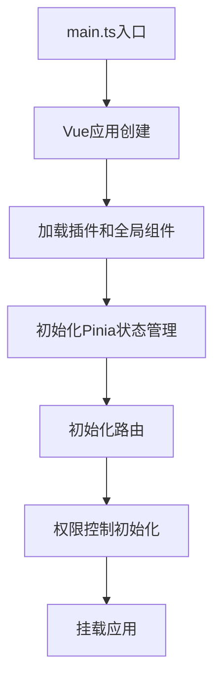

# 前端架构文档

## 一、技术栈概览

```plaintext
| 分类     | 技术选型                          | 说明                       |
| -------- | --------------------------------- | -------------------------- |
| 核心框架 | Vue 3                             | 响应式开发体验             |
| UI组件库 | Element Plus + Tailwind CSS       | 现代化UI设计，支持主题定制 |
| 状态管理 | Pinia                             | 集中式状态管理             |
| 路由     | Vue Router                        | 动态路由加载               |
| 构建工具 | Vite                              | 极速构建体验               |
| HTTP请求 | Axios                             | 请求拦截、响应处理         |
| 工具库   | Lodash                            | 工具函数                   |
| 可视化   | ECharts/AntV                      | 数据大屏支持               |
| 类型检查 | TypeScript                        | 类型安全                   |
| 代码规范 | ESLint + Prettier                 | 代码质量和风格统一         |
| 单元测试 | Vitest + Vue Test Utils           | 组件测试                   |
| 国际化   | vue-i18n                          | 多语言支持                 |
```

## 二、项目结构

### 2.1 目录结构

```plaintext
frontend/
├── public/                  # 静态资源
├── src/
│   ├── api/                 # API接口定义
│   │   ├── index.ts         # API导出
│   │   ├── modules/         # 按模块组织的API
│   │   └── request.ts       # Axios实例和拦截器
│   ├── assets/              # 项目资源文件
│   ├── components/          # 组件
│   │   ├── common/          # 通用组件
│   │   └── business/        # 业务组件
│   ├── composables/         # 组合式函数
│   ├── config/              # 配置文件
│   ├── directives/          # 自定义指令
│   ├── hooks/               # 自定义钩子函数
│   ├── icons/               # SVG图标
│   ├── layout/              # 布局组件
│   ├── router/              # 路由配置
│   │   ├── index.ts         # 路由实例
│   │   ├── routes.ts        # 路由定义
│   │   └── guard.ts         # 路由守卫
│   ├── store/               # Pinia状态管理
│   │   ├── index.ts         # Store入口
│   │   └── modules/         # 按模块组织的Store
│   ├── styles/              # 全局样式
│   ├── utils/               # 工具函数
│   ├── views/               # 页面组件
│   ├── App.vue              # 根组件
│   ├── main.ts              # 入口文件
│   ├── env.d.ts             # 环境变量类型
│   └── permission.ts        # 权限控制
├── .env                     # 环境变量
├── .env.development         # 开发环境变量
├── .env.production          # 生产环境变量
├── vite.config.ts           # Vite配置
└── tsconfig.json            # TypeScript配置
```

### 2.2 模块划分

```plaintext
views/
├── dashboard/               # 首页/仪表盘
├── system/                  # 系统管理
│   ├── user/                # 用户管理
│   ├── role/                # 角色管理
│   ├── menu/                # 菜单管理
│   └── dept/                # 部门管理
├── monitor/                 # 系统监控
│   ├── server/              # 服务器监控
│   ├── online/              # 在线用户
│   └── logs/                # 日志监控
└── tool/                    # 系统工具
    ├── generator/           # 代码生成
    └── swagger/             # 接口文档
```

## 三、核心架构设计

### 3.1 应用初始化流程



### 3.2 权限控制架构

基于RBAC模型的前端权限控制实现：

1. **角色-权限校验**：使用用户角色和权限列表控制页面访问和操作权限
2. **动态路由生成**：根据用户权限动态生成可访问路由
3. **组件级权限**：使用自定义指令v-permission控制组件可见性
4. **API权限**：请求拦截器中对API请求进行权限校验

```typescript
// permission.ts
import router from './router';
import { useUserStore } from './store/modules/user';
import { usePermissionStore } from './store/modules/permission';

const whiteList = ['/login', '/auth-redirect', '/404', '/403'];

router.beforeEach(async (to, from, next) => {
  const userStore = useUserStore();
  const permissionStore = usePermissionStore();

  if (userStore.token) {
    if (to.path === '/login') {
      next({ path: '/' });
    } else {
      if (userStore.roles.length === 0) {
        try {
          // 获取用户信息和权限
          await userStore.getUserInfo();

          // 生成动态路由
          const accessRoutes = await permissionStore.generateRoutes(userStore.roles);

          // 添加动态路由
          accessRoutes.forEach(route => {
            router.addRoute(route);
          });

          // 确保路由完全加载
          next({ ...to, replace: true });
        } catch (error) {
          // 处理异常
          await userStore.logout();
          next(`/login?redirect=${to.path}`);
        }
      } else {
        next();
      }
    }
  } else {
    if (whiteList.includes(to.path)) {
      next();
    } else {
      next(`/login?redirect=${to.path}`);
    }
  }
});
```

### 3.3 状态管理设计

采用基于模块化的Pinia状态管理：

```typescript
// store/modules/user.ts
import { defineStore } from 'pinia';
import { login, getUserInfo, logout } from '@/api/modules/auth';
import { getToken, setToken, removeToken } from '@/utils/auth';

export const useUserStore = defineStore('user', {
  state: () => ({
    token: getToken() || '',
    userInfo: null,
    roles: [],
    permissions: []
  }),

  getters: {
    hasPermission: (state) => (permission: string) => {
      return state.permissions.includes(permission);
    }
  },

  actions: {
    async login(username: string, password: string) {
      try {
        const { token } = await login(username, password);
        setToken(token);
        this.token = token;
        return token;
      } catch (error) {
        throw error;
      }
    },

    async getUserInfo() {
      try {
        const { user, roles, permissions } = await getUserInfo();
        this.userInfo = user;
        this.roles = roles;
        this.permissions = permissions;
        return { user, roles, permissions };
      } catch (error) {
        throw error;
      }
    },

    async logout() {
      try {
        await logout();
      } finally {
        this.$reset();
        removeToken();
      }
    }
  }
});
```

### 3.4 路由设计

路由配置采用配置式路由，并结合元数据实现权限控制：

```typescript
// router/routes.ts
import { RouteRecordRaw } from 'vue-router';

const Layout = () => import('@/layout/index.vue');

export const constantRoutes: RouteRecordRaw[] = [
  {
    path: '/login',
    component: () => import('@/views/login/index.vue'),
    meta: { hidden: true }
  },
  {
    path: '/404',
    component: () => import('@/views/error/404.vue'),
    meta: { hidden: true }
  }
];

export const asyncRoutes: RouteRecordRaw[] = [
  {
    path: '/',
    component: Layout,
    redirect: '/dashboard',
    children: [
      {
        path: 'dashboard',
        component: () => import('@/views/dashboard/index.vue'),
        name: 'Dashboard',
        meta: {
          title: '首页',
          icon: 'dashboard',
          affix: true
        }
      }
    ]
  },
  {
    path: '/system',
    component: Layout,
    redirect: '/system/user',
    name: 'System',
    meta: {
      title: '系统管理',
      icon: 'system',
      permissions: ['system:manage']
    },
    children: [
      {
        path: 'user',
        component: () => import('@/views/system/user/index.vue'),
        name: 'User',
        meta: {
          title: '用户管理',
          icon: 'user',
          permissions: ['system:user:list']
        }
      },
      {
        path: 'role',
        component: () => import('@/views/system/role/index.vue'),
        name: 'Role',
        meta: {
          title: '角色管理',
          icon: 'role',
          permissions: ['system:role:list']
        }
      }
    ]
  }
];
```

### 3.5 API请求封装

基于Axios的请求封装，实现统一的请求、响应处理和错误处理：

```typescript
// api/request.ts
import axios, { AxiosRequestConfig, AxiosResponse } from 'axios';
import { ElMessage, ElLoading } from 'element-plus';
import { getToken } from '@/utils/auth';
import { useUserStore } from '@/store/modules/user';

// 创建axios实例
const service = axios.create({
  baseURL: import.meta.env.VITE_API_BASE_URL,
  timeout: 15000
});

// 请求拦截器
service.interceptors.request.use(
  (config) => {
    // 添加token
    const token = getToken();
    if (token) {
      config.headers.Authorization = `Bearer ${token}`;
    }

    // 请求loading
    if (config.loading) {
      ElLoading.service({
        text: 'Loading...',
        background: 'rgba(0, 0, 0, 0.7)'
      });
    }

    return config;
  },
  (error) => {
    console.error('请求错误:', error);
    return Promise.reject(error);
  }
);

// 响应拦截器
service.interceptors.response.use(
  (response: AxiosResponse) => {
    // 关闭loading
    ElLoading.service().close();

    const res = response.data;

    // 处理接口返回的错误码
    if (res.code !== 200) {
      ElMessage.error(res.message || '请求错误');

      // token失效处理
      if (res.code === 401) {
        useUserStore().logout();
        window.location.href = '/login';
      }

      return Promise.reject(new Error(res.message || '请求错误'));
    }

    return res.data;
  },
  (error) => {
    // 关闭loading
    ElLoading.service().close();

    // 错误处理
    ElMessage.error(error.message || '网络错误');
    return Promise.reject(error);
  }
);

// 请求封装
const request = <T = any>(config: AxiosRequestConfig): Promise<T> => {
  return service(config) as any;
};

export default request;
```

## 四、前后端交互规范

### 4.1 API请求格式

```typescript
// 1. GET请求
export function getUserList(params) {
  return request({
    url: '/api/v1/users',
    method: 'get',
    params
  });
}

// 2. POST请求
export function createUser(data) {
  return request({
    url: '/api/v1/users',
    method: 'post',
    data
  });
}

// 3. 文件上传
export function uploadFile(file, onProgress) {
  const formData = new FormData();
  formData.append('file', file);

  return request({
    url: '/api/v1/upload',
    method: 'post',
    data: formData,
    headers: {
      'Content-Type': 'multipart/form-data'
    },
    onUploadProgress: (progressEvent) => {
      if (onProgress) {
        const percentCompleted = Math.round(
          (progressEvent.loaded * 100) / progressEvent.total
        );
        onProgress(percentCompleted);
      }
    }
  });
}
```

### 4.2 API响应处理

```typescript
// 1. 基本使用
const fetchUsers = async () => {
  try {
    loading.value = true;
    const { list, total } = await getUserList({
      page: 1,
      pageSize: 10
    });
    userList.value = list;
    pagination.total = total;
  } catch (error) {
    console.error(error);
  } finally {
    loading.value = false;
  }
};

// 2. 表单提交
const submitForm = async () => {
  try {
    await formRef.value.validate();
    loading.value = true;

    if (form.id) {
      await updateUser(form);
      ElMessage.success('更新成功');
    } else {
      await createUser(form);
      ElMessage.success('创建成功');
    }

    dialogVisible.value = false;
    fetchUserList();
  } catch (error) {
    console.error(error);
  } finally {
    loading.value = false;
  }
};
```

## 五、性能优化策略

### 5.1 关键优化措施

1. **路由懒加载**：非首页路由组件使用懒加载
2. **组件按需引入**：UI库组件按需导入
3. **图片优化**：使用Webp格式，小图标使用SVG
4. **虚拟滚动**：长列表使用虚拟滚动
5. **缓存控制**：合理使用组件缓存keep-alive
6. **代码分割**：基于路由的代码分割
7. **Tree-shaking**：移除未使用的代码
8. **SSR/预渲染**：关键页面使用服务端渲染

### 5.2 构建优化

1. **Gzip压缩**：开启Gzip压缩
2. **CDN加载**：第三方库使用CDN加载
3. **浏览器缓存**：静态资源合理设置缓存策略
4. **资源预加载**：关键资源使用预加载

## 六、安全策略

### 6.1 前端安全措施

1. **XSS防护**：输入过滤、输出转义
2. **CSRF防护**：添加CSRF Token
3. **敏感信息保护**：不在前端存储敏感信息
4. **API访问控制**：基于角色的API访问控制
5. **HTTP安全头**：合理设置HTTP安全头
6. **第三方库安全**：定期更新依赖

### 6.2 登录安全

1. **密码加密**：密码传输前加密
2. **多因素认证**：支持多因素认证
3. **登录限制**：限制登录尝试次数
4. **会话管理**：合理设置Token过期时间

## 七、开发流程与规范

### 7.1 开发流程

1. **需求分析**：明确功能需求和设计要求
2. **方案设计**：设计技术方案和组件结构
3. **编码实现**：按照规范进行编码
4. **自测联调**：组件自测和接口联调
5. **代码评审**：团队代码评审
6. **提交测试**：提交测试环境测试
7. **修复问题**：修复测试反馈的问题
8. **发布上线**：部署到生产环境

### 7.2 版本控制

1. **分支管理**：
   - master: 主分支，稳定版本
   - develop: 开发分支
   - feature/xxx: 功能分支
   - hotfix/xxx: 修复分支

2. **提交规范**：
   - feat: 新功能
   - fix: 修复bug
   - docs: 文档更新
   - style: 代码格式调整
   - refactor: 重构
   - perf: 性能优化
   - test: 测试相关
   - build: 构建相关
   - ci: CI配置相关
   - chore: 其他修改

## 八、技术栈集成详解

### 8.1 Vue3 + TypeScript

1. **组合式API**：使用Composition API组织代码
2. **TypeScript**：使用TypeScript提供类型安全
3. **SFC**：使用单文件组件开发

### 8.2 Element Plus

1. **按需导入**：组件按需导入减小体积
2. **主题定制**：自定义主题变量
3. **组件封装**：二次封装统一风格

### 8.3 Tailwind CSS

1. **原子类**：使用原子类快速构建UI
2. **自定义配置**：扩展主题和变量
3. **按需生成**：只生成使用到的样式

### 8.4 Vite

1. **快速启动**：免编译启动开发服务器
2. **按需编译**：仅编译浏览器请求的模块
3. **插件体系**：使用各种Vite插件增强功能

```
