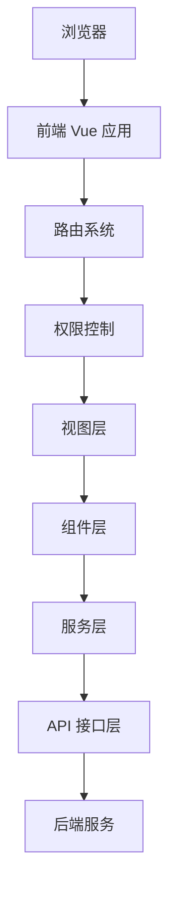
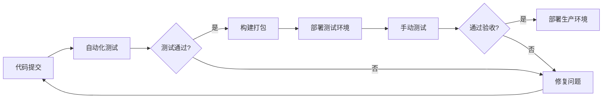

# AdminFlow 前端架构文档

## 一、技术选型

```plaintext
| 分类     | 技术选型                          | 说明                             |
| -------- | --------------------------------- | -------------------------------- |
| 核心框架 | Vue 3                             | 响应式开发体验，支持Composition API |
| UI组件库 | Element Plus + Tailwind CSS       | 现代化UI设计，支持主题定制       |
| 状态管理 | Pinia                             | 高性能状态管理，支持TypeScript   |
| 路由     | Vue Router                        | 动态路由加载，权限控制           |
| 构建工具 | Vite                              | 极速构建体验，优秀的开发体验     |
| 网络请求 | Axios                             | 拦截器、请求/响应处理            |
| 工具库   | Lodash / dayjs                    | 工具函数集合和日期处理           |
| 可视化   | ECharts / AntV                    | 数据图表展示和大屏支持           |
| 类型系统 | TypeScript                        | 类型安全，提高代码质量           |
| 代码规范 | ESLint + Prettier                 | 代码风格统一                     |
| 单元测试 | Vitest + Vue Test Utils           | 组件测试和功能测试               |
| 国际化   | vue-i18n                          | 多语言支持                       |
| 表单验证 | vee-validate / async-validator    | 表单数据验证                     |
```

## 二、系统架构

### 2.1 架构设计



### 2.2 分层架构

1. **视图层(Views)**：页面级组件，负责页面整体布局和业务流程
2. **组件层(Components)**：UI组件，负责界面交互和展示
3. **服务层(Services)**：业务逻辑处理，数据加工
4. **API层(API)**：与后端通信，处理请求和响应
5. **状态层(Store)**：全局状态管理，保存共享数据
6. **工具层(Utils)**：通用工具函数，辅助功能

### 2.3 前后端交互

基于RESTful API进行前后端交互：

1. **请求封装**：使用Axios统一处理请求和响应
2. **数据格式**：统一使用JSON格式
3. **状态码**：遵循HTTP状态码规范
4. **错误处理**：统一处理网络错误和业务错误
5. **接口版本**：使用URL路径版本控制(v1, v2...)

## 三、功能模块

### 3.1 核心模块

1. **用户认证**：登录、注册、找回密码、令牌刷新
2. **权限管理**：基于RBAC模型的前端权限控制
3. **路由管理**：动态路由生成，菜单权限控制
4. **布局系统**：可配置的页面布局系统
5. **主题管理**：支持明暗主题切换和自定义主题

### 3.2 业务模块

1. **系统管理**：用户、角色、菜单、部门管理
2. **数据监控**：服务器、缓存、日志监控
3. **工具模块**：代码生成、接口文档、表单设计
4. **个人中心**：个人信息、密码修改、操作日志

## 四、目录结构

请参考[目录结构规范.md](./目录结构规范.md)文档

## 五、状态管理设计

### 5.1 Pinia Store设计

```typescript
// store/modules/user.ts
import { defineStore } from 'pinia';
import { getUserInfo, login, logout } from '@/api/modules/auth';
import { removeToken, setToken } from '@/utils/auth';

export const useUserStore = defineStore('user', {
  // 状态定义
  state: () => ({
    token: '',
    userInfo: null,
    roles: [],
    permissions: []
  }),

  // 计算属性
  getters: {
    hasPermission: (state) => (permission) => {
      return state.permissions.includes(permission);
    },
    isLogin: (state) => !!state.token
  },

  // 动作方法
  actions: {
    // 登录
    async login(username, password) {
      try {
        const res = await login({ username, password });
        this.token = res.token;
        setToken(res.token);
        return res;
      } catch (error) {
        console.error('登录失败:', error);
        throw error;
      }
    },

    // 获取用户信息
    async getUserInfo() {
      try {
        const res = await getUserInfo();
        this.userInfo = res.user;
        this.roles = res.roles;
        this.permissions = res.permissions;
        return res;
      } catch (error) {
        console.error('获取用户信息失败:', error);
        throw error;
      }
    },

    // 退出登录
    async logout() {
      try {
        await logout();
      } catch (error) {
        console.error('退出登录失败:', error);
      } finally {
        this.resetState();
      }
    },

    // 重置状态
    resetState() {
      this.token = '';
      this.userInfo = null;
      this.roles = [];
      this.permissions = [];
      removeToken();
    }
  }
});
```

### 5.2 状态管理原则

1. **模块化**：按业务模块拆分Store
2. **最小化**：只存储必要的全局状态
3. **类型安全**：使用TypeScript类型定义
4. **持久化**：敏感数据不持久化，必要数据使用本地存储

## 六、权限控制设计

### 6.1 菜单和路由权限

```typescript
// router/guard.ts
import { useUserStore } from '@/store/modules/user';
import { usePermissionStore } from '@/store/modules/permission';

// 路由前置守卫
router.beforeEach(async (to, from, next) => {
  const userStore = useUserStore();
  const permissionStore = usePermissionStore();

  // 已登录
  if (userStore.token) {
    if (to.path === '/login') {
      next({ path: '/' });
    } else {
      // 是否已加载用户权限
      if (userStore.roles.length === 0) {
        try {
          // 获取用户信息(包含角色)
          await userStore.getUserInfo();

          // 根据角色生成可访问路由
          const accessRoutes = await permissionStore.generateRoutes(userStore.roles);

          // 动态添加路由
          accessRoutes.forEach(route => {
            router.addRoute(route);
          });

          // 确保路由完整加载
          next({ ...to, replace: true });
        } catch (error) {
          // 获取信息失败，清空令牌并重定向到登录
          userStore.resetState();
          next(`/login?redirect=${encodeURIComponent(to.fullPath)}`);
        }
      } else {
        next();
      }
    }
  } else {
    // 未登录，判断是否为白名单页面
    if (whiteList.includes(to.path)) {
      next();
    } else {
      next(`/login?redirect=${encodeURIComponent(to.fullPath)}`);
    }
  }
});
```

### 6.2 按钮权限控制

```typescript
// directives/permission.ts
import { useUserStore } from '@/store/modules/user';

// 权限指令
export const permission = {
  mounted(el, binding) {
    const { value } = binding;
    const userStore = useUserStore();

    if (value && value instanceof Array && value.length > 0) {
      const hasPermission = value.some(permission => {
        return userStore.permissions.includes(permission);
      });

      if (!hasPermission) {
        el.parentNode?.removeChild(el);
      }
    } else {
      throw new Error('需要指定权限标识');
    }
  }
};

// 使用示例
// <button v-permission="['system:user:add']">添加用户</button>
```

## 七、前端国际化

### 7.1 国际化配置

```typescript
// i18n/index.ts
import { createI18n } from 'vue-i18n';
import zhCN from './locales/zh-CN';
import enUS from './locales/en-US';

const messages = {
  'zh-CN': zhCN,
  'en-US': enUS
};

const i18n = createI18n({
  legacy: false,
  locale: localStorage.getItem('language') || 'zh-CN',
  fallbackLocale: 'zh-CN',
  messages
});

export default i18n;
```

### 7.2 语言文件结构

```typescript
// i18n/locales/zh-CN.ts
export default {
  route: {
    dashboard: '首页',
    system: '系统管理',
    user: '用户管理',
    role: '角色管理'
  },
  navbar: {
    profile: '个人中心',
    password: '修改密码',
    logout: '退出登录'
  },
  login: {
    title: '系统登录',
    username: '用户名',
    password: '密码',
    login: '登录',
    captcha: '验证码'
  }
};
```

## 八、主题定制

### 8.1 主题变量

```scss
// styles/variables.scss
:root {
  // 主题色
  --el-color-primary: #409eff;
  --el-color-success: #67c23a;
  --el-color-warning: #e6a23c;
  --el-color-danger: #f56c6c;
  --el-color-info: #909399;

  // 文字颜色
  --el-text-color-primary: #303133;
  --el-text-color-regular: #606266;
  --el-text-color-secondary: #909399;

  // 边框颜色
  --el-border-color-light: #e4e7ed;
  --el-border-color: #dcdfe6;
  --el-border-color-dark: #d4d7de;

  // 背景颜色
  --el-bg-color: #ffffff;
  --el-bg-color-page: #f2f3f5;
  --el-bg-color-overlay: #ffffff;
}

// 暗黑模式
html.dark {
  --el-color-primary: #409eff;

  --el-text-color-primary: #e5eaf3;
  --el-text-color-regular: #cfd3dc;
  --el-text-color-secondary: #a3a6ad;

  --el-border-color-light: #414243;
  --el-border-color: #363637;
  --el-border-color-dark: #2e2e2f;

  --el-bg-color: #141414;
  --el-bg-color-page: #0a0a0a;
  --el-bg-color-overlay: #1d1e1f;
}
```

### 8.2 主题切换

```typescript
// composables/useTheme.ts
import { useDark, useToggle } from '@vueuse/core';

export function useTheme() {
  const isDark = useDark();
  const toggleDark = useToggle(isDark);

  // 切换主题
  const toggleTheme = () => {
    toggleDark();
    setElmentPlusTheme(isDark.value);
  };

  // 设置ElementPlus主题
  const setElmentPlusTheme = (dark: boolean) => {
    // 设置ElementPlus的暗黑模式
    document.documentElement.classList.toggle('dark', dark);
    // 保存用户主题偏好
    localStorage.setItem('theme', dark ? 'dark' : 'light');
  };

  // 初始化主题
  const initTheme = () => {
    const savedTheme = localStorage.getItem('theme');
    if (savedTheme) {
      const isDarkTheme = savedTheme === 'dark';
      document.documentElement.classList.toggle('dark', isDarkTheme);
    }
  };

  return {
    isDark,
    toggleTheme,
    initTheme
  };
}
```

## 九、性能优化策略

### 9.1 构建优化

1. **代码分割**：
   - 路由组件懒加载
   - 第三方库拆分
   - 公共模块提取

2. **资源优化**：
   - 图片压缩
   - 静态资源CDN
   - Gzip压缩

### 9.2 运行时优化

1. **虚拟滚动**：长列表使用虚拟滚动
2. **组件缓存**：使用keep-alive缓存组件
3. **计算优化**：避免在模板中进行复杂计算
4. **数据懒加载**：按需加载数据
5. **防抖节流**：对频繁触发的事件应用防抖/节流

## 十、规范与最佳实践

详见以下文档：

1. [前端开发规范.md](./前端开发规范.md)：编码风格、目录结构等规范
2. [UI组件规范.md](./UI组件规范.md)：组件设计和使用规范
3. [接口调用规范.md](./接口调用规范.md)：API调用规范

## 十一、持续集成与部署

### 11.1 构建流程



### 11.2 持续集成配置

```yaml
# .github/workflows/ci.yml
name: Frontend CI

on:
  push:
    branches: [ main, develop ]
  pull_request:
    branches: [ main, develop ]

jobs:
  build:
    runs-on: ubuntu-latest

    steps:
    - uses: actions/checkout@v2

    - name: Setup Node.js
      uses: actions/setup-node@v2
      with:
        node-version: '16'

    - name: Install dependencies
      run: npm ci

    - name: Lint
      run: npm run lint

    - name: Test
      run: npm run test:unit

    - name: Build
      run: npm run build

    - name: Deploy to testing
      if: github.ref == 'refs/heads/develop'
      run: npm run deploy:test

    - name: Deploy to production
      if: github.ref == 'refs/heads/main'
      run: npm run deploy:prod
```

## 十二、前后端联调与测试

### 12.1 开发环境配置

```javascript
// .env.development
VITE_API_BASE_URL = '/api'
VITE_MOCK_ENABLED = true
```

### 12.2 接口Mock

使用vite-plugin-mock进行接口模拟：

```typescript
// mock/user.ts
import { MockMethod } from 'vite-plugin-mock';

export default [
  {
    url: '/api/v1/auth/login',
    method: 'post',
    response: ({ body }) => {
      const { username, password } = body;

      if (username === 'admin' && password === '123456') {
        return {
          code: 200,
          data: {
            token: 'admin-token',
            user: {
              id: 1,
              username: 'admin',
              nickname: '管理员'
            }
          },
          message: '登录成功'
        };
      }

      return {
        code: 400,
        data: null,
        message: '用户名或密码错误'
      };
    }
  }
] as MockMethod[];
```

### 12.3 接口代理配置

```typescript
// vite.config.ts
export default defineConfig({
  server: {
    proxy: {
      '/api': {
        target: 'http://localhost:8080',
        changeOrigin: true,
        rewrite: (path) => path.replace(/^\/api/, '')
      }
    }
  }
});
```
