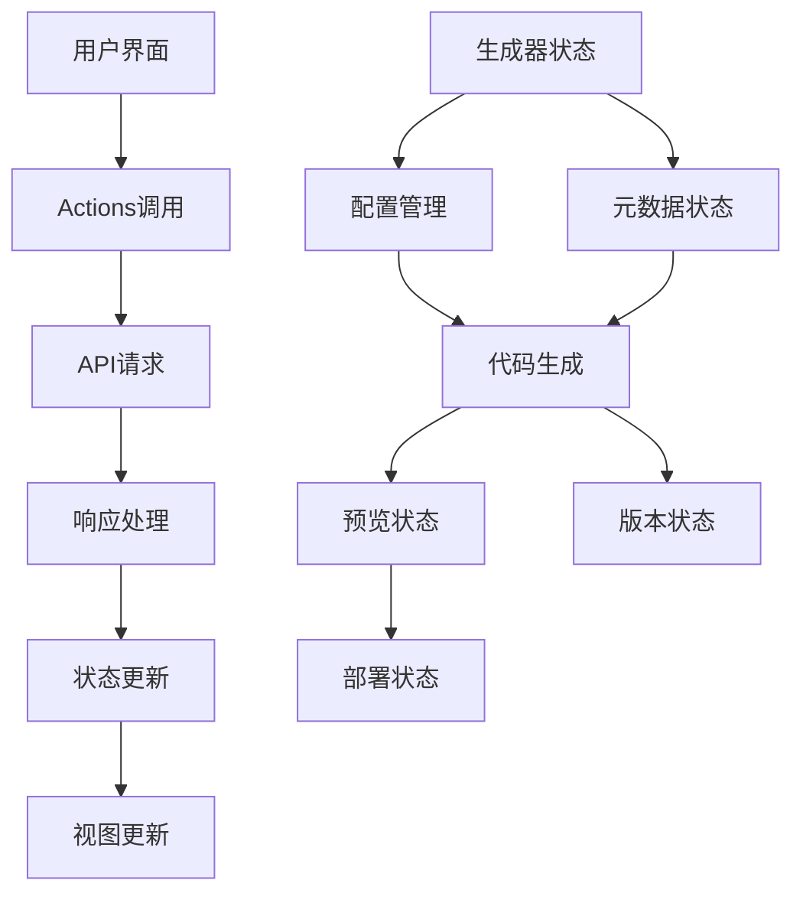
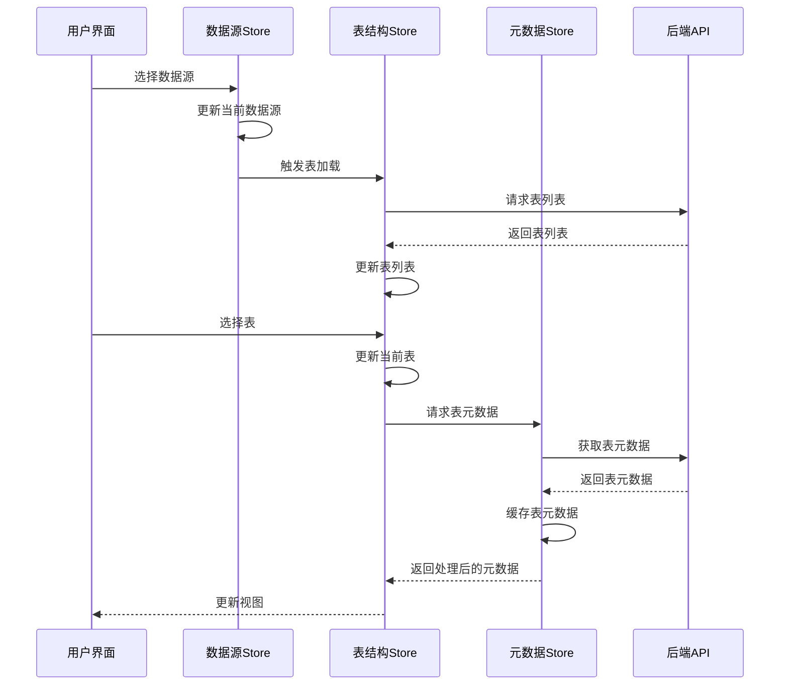
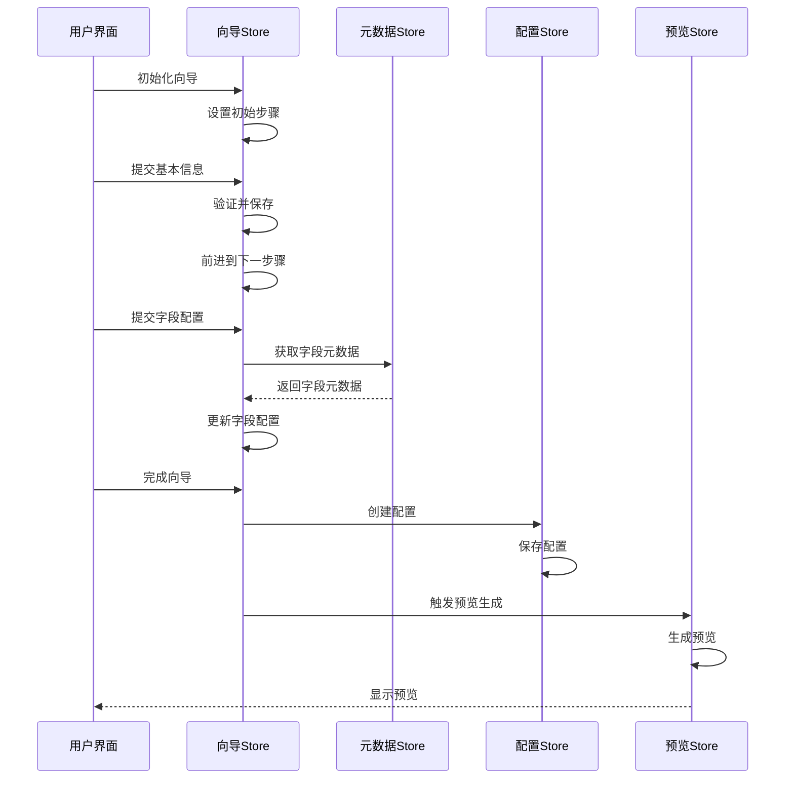

# 代码生成器状态管理设计文档

## 一、概述

本文档详细说明代码生成器模块的状态管理方案，基于Pinia实现，确保各子模块数据流清晰、可预测且便于维护。状态管理设计遵循单向数据流原则，实现状态的集中管理与高效更新。

## 二、架构设计

### 2.1 整体架构

```
+------------------------------------------+
|              应用状态层                   |
|  +--------------+    +--------------+    |
|  | 根Store      |    | 路由状态     |    |
|  +--------------+    +--------------+    |
+------------------------------------------+
                   |
                   v
+------------------------------------------+
|           代码生成器状态层                |
|  +--------------+    +--------------+    |
|  | 共享状态     |<-->| 生成配置     |    |
|  +--------------+    +--------------+    |
|         ^                   ^            |
|         |                   |            |
|  +--------------+    +--------------+    |
|  | 元数据状态   |<-->| 模板状态     |    |
|  +--------------+    +--------------+    |
+------------------------------------------+
                   |
                   v
+------------------------------------------+
|             功能模块状态层                |
|  +------+  +------+  +------+  +------+  |
|  |数据源|  |表结构|  |向导  |  |配置  |  |
|  +------+  +------+  +------+  +------+  |
|                                          |
|  +------+  +------+  +------+            |
|  |预览  |  |版本  |  |部署  |            |
|  +------+  +------+  +------+            |
+------------------------------------------+
```

### 2.2 Store划分

基于功能模块和关注点分离原则，将状态管理划分为以下几个Store：

1. **核心Store**
   - `generatorStore` - 管理全局生成器状态

2. **功能模块Store**
   - `datasourceStore` - 数据源管理
   - `tableStore` - 表结构管理
   - `wizardStore` - 代码生成向导
   - `configStore` - 配置管理
   - `previewStore` - 代码预览
   - `versionStore` - 版本管理

3. **共享Store**
   - `metadataStore` - 元数据管理
   - `templateStore` - 模板管理
   - `deployStore` - 部署管理

## 三、各Store详细设计

### 3.1 核心Store (generatorStore)

```typescript
// 状态定义
export interface GeneratorState {
  currentStep: string;                     // 当前步骤
  generationHistory: GenerationRecord[];   // 生成历史记录
  recentProjects: RecentProject[];         // 最近项目
  globalSettings: GlobalSettings;          // 全局设置
  isGenerating: boolean;                   // 是否正在生成
  lastGeneratedId: string | null;          // 最后生成的ID
}

// 操作定义
export interface GeneratorActions {
  setCurrentStep(step: string): void;
  addToHistory(record: GenerationRecord): void;
  updateGlobalSettings(settings: Partial<GlobalSettings>): void;
  startGeneration(): void;
  finishGeneration(id: string): void;
  loadRecentProjects(): Promise<void>;
}
```

### 3.2 数据源管理 (datasourceStore)

```typescript
// 状态定义
export interface DatasourceState {
  datasources: Datasource[];              // 数据源列表
  currentDatasource: Datasource | null;   // 当前选中数据源
  connectionStatus: ConnectionStatus;     // 连接状态
  isLoading: boolean;                     // 加载状态
  error: string | null;                   // 错误信息
}

// 操作定义
export interface DatasourceActions {
  fetchDatasources(): Promise<Datasource[]>;
  createDatasource(datasource: DatasourceCreateDto): Promise<Datasource>;
  updateDatasource(id: number, datasource: DatasourceUpdateDto): Promise<Datasource>;
  deleteDatasource(id: number): Promise<void>;
  testConnection(datasource: Datasource): Promise<ConnectionStatus>;
  selectDatasource(id: number): void;
}
```

### 3.3 表结构管理 (tableStore)

```typescript
// 状态定义
export interface TableState {
  tables: Table[];                        // 表列表
  currentTable: Table | null;             // 当前选中表
  currentTableColumns: TableColumn[];     // 当前表字段
  tableRelations: TableRelation[];        // 表关系
  isLoading: boolean;                     // 加载状态
  error: string | null;                   // 错误信息
}

// 操作定义
export interface TableActions {
  fetchTables(datasourceId: number): Promise<Table[]>;
  fetchTableColumns(tableId: number): Promise<TableColumn[]>;
  fetchTableRelations(tableId: number): Promise<TableRelation[]>;
  selectTable(tableId: number): void;
  refreshTableStructure(tableId: number): Promise<void>;
  updateColumnConfig(columnId: number, config: ColumnConfigUpdateDto): Promise<TableColumn>;
}
```

### 3.4 代码生成向导 (wizardStore)

```typescript
// 状态定义
export interface WizardState {
  steps: WizardStep[];                    // 向导步骤
  currentStepIndex: number;               // 当前步骤索引
  wizardData: WizardData;                 // 向导数据
  validationErrors: ValidationError[];    // 验证错误
  isCompleted: boolean;                   // 是否完成
}

// 操作定义
export interface WizardActions {
  initWizard(initialData?: Partial<WizardData>): void;
  goToNextStep(): boolean;
  goToPrevStep(): void;
  goToStep(index: number): void;
  updateStepData(step: string, data: any): void;
  validateCurrentStep(): ValidationError[];
  completeWizard(): Promise<GenerationResult>;
  resetWizard(): void;
}
```

### 3.5 配置管理 (configStore)

```typescript
// 状态定义
export interface ConfigState {
  configs: Config[];                      // 配置列表
  currentConfig: Config | null;           // 当前选中配置
  configTemplates: ConfigTemplate[];      // 配置模板
  isLoading: boolean;                     // 加载状态
  error: string | null;                   // 错误信息
}

// 操作定义
export interface ConfigActions {
  fetchConfigs(): Promise<Config[]>;
  fetchConfigById(id: number): Promise<Config>;
  createConfig(config: ConfigCreateDto): Promise<Config>;
  updateConfig(id: number, config: ConfigUpdateDto): Promise<Config>;
  deleteConfig(id: number): Promise<void>;
  duplicateConfig(id: number): Promise<Config>;
  exportConfig(id: number): Promise<Blob>;
  importConfig(file: File): Promise<Config>;
}
```

### 3.6 代码预览 (previewStore)

```typescript
// 状态定义
export interface PreviewState {
  previewFiles: PreviewFile[];            // 预览文件列表
  currentFile: PreviewFile | null;        // 当前预览文件
  fileTree: FileTreeNode[];               // 文件树结构
  previewMode: PreviewMode;               // 预览模式
  editorOptions: EditorOptions;           // 编辑器选项
  unsavedChanges: boolean;                // 是否有未保存更改
}

// 操作定义
export interface PreviewActions {
  generatePreview(configId: number): Promise<void>;
  selectFile(filePath: string): void;
  updateFileContent(filePath: string, content: string): void;
  saveChanges(): Promise<void>;
  changePreviewMode(mode: PreviewMode): void;
  expandFileTree(nodePath: string): void;
  downloadFiles(): Promise<Blob>;
}
```

### 3.7 版本管理 (versionStore)

```typescript
// 状态定义
export interface VersionState {
  versions: Version[];                    // 版本列表
  currentVersion: Version | null;         // 当前版本
  versionDiff: VersionDiff | null;        // 版本差异
  isLoading: boolean;                     // 加载状态
  error: string | null;                   // 错误信息
}

// 操作定义
export interface VersionActions {
  fetchVersions(configId: number): Promise<Version[]>;
  fetchVersionById(id: number): Promise<Version>;
  createVersion(configId: number, note: string): Promise<Version>;
  compareVersions(versionId1: number, versionId2: number): Promise<VersionDiff>;
  rollbackToVersion(versionId: number): Promise<void>;
  deleteVersion(versionId: number): Promise<void>;
}
```

### 3.8 元数据管理 (metadataStore)

```typescript
// 状态定义
export interface MetadataState {
  tableMetadata: Record<string, TableMetadata>;   // 表元数据
  columnTypes: ColumnTypeMapping[];              // 字段类型映射
  componentMappings: ComponentMapping[];         // 组件映射
  validationRules: ValidationRuleMapping[];      // 验证规则映射
}

// 操作定义
export interface MetadataActions {
  fetchTableMetadata(datasourceId: number, tableName: string): Promise<TableMetadata>;
  updateColumnMapping(tableId: string, columnId: string, mapping: Partial<ColumnMapping>): void;
  clearTableMetadata(tableId: string): void;
  refreshMetadata(): Promise<void>;
}
```

### 3.9 部署管理 (deployStore)

```typescript
// 状态定义
export interface DeployState {
  deployments: Deployment[];              // 部署记录
  currentDeployment: Deployment | null;   // 当前部署
  deploymentStatus: DeploymentStatus;     // 部署状态
  deploymentLogs: DeploymentLog[];        // 部署日志
  isDeploying: boolean;                   // 是否正在部署
}

// 操作定义
export interface DeployActions {
  deployCode(configId: number, options: DeployOptions): Promise<Deployment>;
  checkDeploymentStatus(deploymentId: number): Promise<DeploymentStatus>;
  fetchDeploymentLogs(deploymentId: number): Promise<DeploymentLog[]>;
  cancelDeployment(deploymentId: number): Promise<void>;
  retryDeployment(deploymentId: number): Promise<Deployment>;
}
```

## 四、状态交互与数据流

### 4.1 主要数据流向



### 4.2 关键交互场景

#### 4.2.1 数据源选择到表结构加载



#### 4.2.2 向导流程中的状态传递



## 五、持久化策略

### 5.1 持久化范围

- **本地持久化**
  - 向导进度
  - 用户偏好设置
  - 最近访问的项目
  - 编辑器设置

- **服务端持久化**
  - 数据源配置
  - 生成配置
  - 模板
  - 版本历史

### 5.2 持久化实现

```typescript
// 使用pinia-plugin-persistedstate插件
const generator = defineStore('generator', {
  state: () => ({
    // 状态定义
  }),
  actions: {
    // 操作定义
  },
  persist: {
    key: 'generator-state',
    storage: localStorage,
    paths: ['currentStep', 'globalSettings', 'recentProjects']
  }
});

// 使用sessionStorage保存临时向导数据
const wizard = defineStore('wizard', {
  state: () => ({
    // 状态定义
  }),
  actions: {
    // 操作定义
  },
  persist: {
    key: 'wizard-state',
    storage: sessionStorage,
    paths: ['wizardData', 'currentStepIndex']
  }
});
```

## 六、API集成

### 6.1 API模块结构

```typescript
// api/modules/generator.ts
export default {
  // 数据源相关
  datasource: {
    getList: () => request.get('/generator/datasource'),
    create: (data: DatasourceCreateDto) => request.post('/generator/datasource', data),
    update: (id: number, data: DatasourceUpdateDto) =>
      request.put(`/generator/datasource/${id}`, data),
    delete: (id: number) => request.delete(`/generator/datasource/${id}`),
    test: (data: DatasourceTestDto) => request.post('/generator/datasource/test', data)
  },

  // 表结构相关
  table: {
    getList: (datasourceId: number) =>
      request.get('/generator/table', { params: { datasourceId } }),
    getColumns: (tableId: number) =>
      request.get(`/generator/table/${tableId}/columns`),
    getRelations: (tableId: number) =>
      request.get(`/generator/table/${tableId}/relations`),
    refresh: (tableId: number) =>
      request.post(`/generator/table/${tableId}/refresh`)
  },

  // 配置相关
  config: {
    getList: () => request.get('/generator/config'),
    getById: (id: number) => request.get(`/generator/config/${id}`),
    create: (data: ConfigCreateDto) => request.post('/generator/config', data),
    update: (id: number, data: ConfigUpdateDto) =>
      request.put(`/generator/config/${id}`, data),
    delete: (id: number) => request.delete(`/generator/config/${id}`),
    duplicate: (id: number) => request.post(`/generator/config/${id}/duplicate`),
    export: (id: number) => request.get(`/generator/config/${id}/export`,
      { responseType: 'blob' }),
    import: (formData: FormData) => request.post('/generator/config/import', formData, {
      headers: { 'Content-Type': 'multipart/form-data' }
    })
  },

  // 代码生成与预览
  code: {
    generate: (configId: number) =>
      request.post(`/generator/code/generate/${configId}`),
    preview: (configId: number) =>
      request.get(`/generator/code/preview/${configId}`),
    saveChanges: (data: SaveChangesDto) =>
      request.post('/generator/code/save', data),
    download: (configId: number) =>
      request.get(`/generator/code/download/${configId}`,
        { responseType: 'blob' })
  },

  // 版本管理
  version: {
    getList: (configId: number) =>
      request.get('/generator/version', { params: { configId } }),
    getById: (id: number) => request.get(`/generator/version/${id}`),
    create: (data: VersionCreateDto) => request.post('/generator/version', data),
    compare: (params: CompareVersionsDto) =>
      request.get('/generator/version/compare', { params }),
    rollback: (versionId: number) =>
      request.post(`/generator/version/${versionId}/rollback`),
    delete: (id: number) => request.delete(`/generator/version/${id}`)
  },

  // 部署管理
  deploy: {
    deploy: (data: DeployRequestDto) => request.post('/generator/deploy', data),
    status: (deploymentId: number) =>
      request.get(`/generator/deploy/${deploymentId}/status`),
    logs: (deploymentId: number) =>
      request.get(`/generator/deploy/${deploymentId}/logs`),
    cancel: (deploymentId: number) =>
      request.post(`/generator/deploy/${deploymentId}/cancel`),
    retry: (deploymentId: number) =>
      request.post(`/generator/deploy/${deploymentId}/retry`)
  }
};
```

### 6.2 Store与API集成示例

```typescript
// stores/datasourceStore.ts
export const useDatasourceStore = defineStore('datasource', {
  state: () => ({
    datasources: [],
    currentDatasource: null,
    connectionStatus: null,
    isLoading: false,
    error: null
  }),

  actions: {
    async fetchDatasources() {
      this.isLoading = true;
      this.error = null;

      try {
        const response = await generatorApi.datasource.getList();
        this.datasources = response.data;
        return this.datasources;
      } catch (err) {
        this.error = getErrorMessage(err);
        throw err;
      } finally {
        this.isLoading = false;
      }
    },

    async createDatasource(datasource: DatasourceCreateDto) {
      this.isLoading = true;
      this.error = null;

      try {
        const response = await generatorApi.datasource.create(datasource);
        const newDatasource = response.data;
        this.datasources.push(newDatasource);
        return newDatasource;
      } catch (err) {
        this.error = getErrorMessage(err);
        throw err;
      } finally {
        this.isLoading = false;
      }
    },

    // ... 其他操作
  }
});
```

## 七、最佳实践与约定

### 7.1 命名约定

- **Store 命名**: `use{Module}Store`
- **State 类型**: `{Module}State`
- **Actions 类型**: `{Module}Actions`
- **Getters 类型**: `{Module}Getters`

### 7.2 代码组织

- 每个功能模块的Store独立文件
- API请求与状态管理分离
- 共用类型定义放在types目录

### 7.3 性能优化

- 使用局部状态避免不必要的全局状态
- 大型列表数据使用分页加载
- 合理使用计算属性减少重复计算
- 利用持久化减少不必要的API请求

### 7.4 错误处理

- 统一错误处理流程
- 错误信息存储在相应Store中
- 提供重试机制与回退策略
- 开发环境详细错误，生产环境友好提示

## 八、总结

本文档详细设计了代码生成器模块的状态管理方案，基于Pinia实现，采用模块化、关注点分离原则，确保各功能模块数据流清晰可预测。通过合理的状态划分与持久化策略，提升了系统的可维护性与用户体验，为代码生成器提供了强大的状态管理基础。

随着项目的发展，状态管理方案可以进一步优化，如引入中间件、集成更多异步处理模式、增强持久化能力等，以适应更复杂的业务需求。
