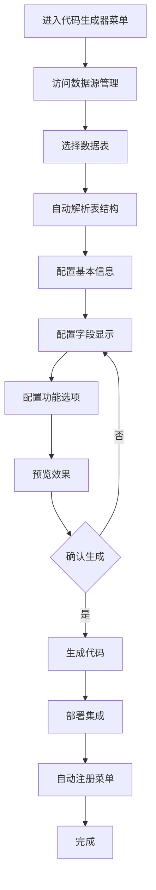

# 代码生成器模块开发文档

## 一、模块概述

### 1.1 功能定位

代码生成器是AdminFlow平台的核心功能模块，旨在通过可视化配置界面，让用户无需编写代码即可生成完整的前后端功能模块。面向系统管理员、产品经理、业务人员设计，降低技术门槛，提升业务开发效率。

### 1.2 核心价值

- **提升开发效率**：将传统编码过程自动化，缩短开发周期
- **标准化代码**：确保生成代码符合统一规范，提高系统整体质量
- **降低技术门槛**：使非技术人员也能参与系统功能扩展
- **减少重复劳动**：解放开发人员，专注创造性工作
- **快速响应需求**：迅速将业务需求转化为系统功能

### 1.3 用户角色

| 角色 | 使用需求 | 关注点 |
|-----|--------|-------|
| 系统管理员 | 快速构建管理功能 | 易用性、稳定性 |
| 产品经理 | 快速验证产品原型 | 预览效果、灵活性 |
| 业务人员 | 临时数据管理需求 | 简单操作、功能完整性 |
| 初级开发者 | 学习系统架构 | 代码规范、最佳实践 |

## 二、页面结构与组件

### 2.1 目录结构设计

代码生成器采用目录菜单的设计模式，generator作为父级菜单，不包含index.vue文件，而是将具体功能放在子目录中：

```
views/generator/
├── README.md                     # 开发文档
├── components/                   # 共享组件目录
│   ├── FormDesigner.vue         # 表单设计器
│   ├── TableDesigner.vue        # 表格设计器
│   ├── QueryDesigner.vue        # 查询设计器
│   └── CodeEditor.vue           # 代码编辑器
├── hooks/                        # 共享hooks目录
│   ├── useCodeGeneration.ts     # 通用代码生成hook
│   ├── useValidation.ts         # 通用验证逻辑
│   └── useNotification.ts       # 通用通知逻辑
├── datasource/                   # 数据源管理模块
│   ├── index.vue                 # 数据源列表页面
│   ├── components/              # 数据源模块组件
│   │   ├── DatasourceTable.vue  # 数据源列表表格
│   │   ├── DatasourceForm.vue   # 数据源表单对话框
│   │   └── ConnectionTest.vue   # 连接测试组件
│   └── hooks/                   # 数据源模块逻辑
│       ├── useDatasource.ts     # 数据源CRUD逻辑
│       └── useConnection.ts     # 连接测试逻辑
├── table/                        # 表结构管理模块
│   ├── index.vue                 # 表列表页面
│   ├── components/              # 表结构模块组件
│   │   ├── TableList.vue        # 表列表组件
│   │   ├── TableDetail.vue      # 表结构详情组件
│   │   └── ColumnList.vue       # 字段列表组件
│   └── hooks/                   # 表结构模块逻辑
│       ├── useTableList.ts      # 表列表逻辑
│       └── useTableDetail.ts    # 表详情逻辑
├── wizard/                       # 代码生成向导模块
│   ├── index.vue                 # 向导主页面
│   ├── components/              # 向导模块组件
│   │   ├── StepNav.vue          # 步骤导航组件
│   │   └── Preview.vue          # 实时预览组件
│   ├── steps/                   # 向导步骤组件
│   │   ├── BasicInfo.vue        # 基本信息配置步骤
│   │   ├── FieldConfig.vue      # 字段配置步骤
│   │   ├── PageConfig.vue       # 页面配置步骤
│   │   ├── AdvancedConfig.vue   # 高级配置步骤
│   │   └── PreviewConfirm.vue   # 预览确认步骤
│   └── hooks/                   # 向导模块逻辑
│       ├── useWizardState.ts    # 向导状态管理
│       ├── useFieldConfig.ts    # 字段配置逻辑
│       └── usePreview.ts        # 预览逻辑
├── config/                       # 配置管理模块
│   ├── index.vue                 # 配置列表页面
│   ├── components/              # 配置模块组件
│   │   ├── ConfigTable.vue      # 配置列表表格
│   │   ├── ConfigDetail.vue     # 配置详情抽屉
│   │   └── ImportTable.vue      # 导入表结构表单
│   └── hooks/                   # 配置模块逻辑
│       ├── useConfigList.ts     # 配置列表逻辑
│       └── useImportTable.ts    # 表导入逻辑
├── preview/                      # 代码预览模块
│   ├── index.vue                 # 预览页面
│   ├── components/              # 预览模块组件
│   │   ├── CodePreview.vue      # 代码预览组件
│   │   ├── FileTree.vue         # 文件树组件
│   │   └── DeployOptions.vue    # 部署选项组件
│   └── hooks/                   # 预览模块逻辑
│       ├── useCodePreview.ts    # 代码预览逻辑
│       └── useDeploy.ts         # 部署逻辑
└── version/                      # 版本管理模块
    ├── index.vue                 # 版本列表页面
    ├── components/              # 版本模块组件
    │   ├── VersionTable.vue     # 版本列表表格
    │   ├── VersionDetail.vue    # 版本详情对话框
    │   └── RollbackConfirm.vue  # 回滚确认组件
    └── hooks/                   # 版本模块逻辑
        ├── useVersionList.ts    # 版本列表逻辑
        └── useRollback.ts       # 回滚逻辑
```

### 2.2 总体布局

代码生成器子模块采用清晰的三栏布局：

```
+-------------------------------------------------------+
|                     头部导航栏                         |
+----------+-----------------------------+--------------+
|          |                             |              |
|  左侧    |        中间配置区           |   右侧      |
|  步骤    |                             |   预览区    |
|  导航    |                             |              |
|          |                             |              |
|          |                             |              |
+----------+-----------------------------+--------------+
|                     底部操作栏                         |
+-------------------------------------------------------+
```

### 2.3 主要页面组件

模块包含以下主要页面和组件：

#### 2.3.1 数据源管理 (datasource/index.vue)

- 数据源列表页面
- 功能：CRUD操作，测试连接
- 组件：
  - 数据源列表表格 (components/DatasourceTable.vue)
  - 数据源表单对话框 (components/DatasourceForm.vue)
  - 连接测试组件 (components/ConnectionTest.vue)

#### 2.3.2 表结构浏览 (table/index.vue)

- 数据库表结构浏览页面
- 功能：表列表浏览，表结构详情查看
- 组件：
  - 表列表组件 (components/TableList.vue)
  - 表结构详情组件 (components/TableDetail.vue)
  - 字段列表组件 (components/ColumnList.vue)

#### 2.3.3 代码生成向导 (wizard/index.vue)

- 代码生成步骤向导页面
- 功能：引导式配置，步骤导航
- 布局：左侧步骤导航，中间配置区，右侧预览区
- 组件：
  - 步骤导航组件 (components/StepNav.vue)
  - 步骤内容组件 (各步骤具体组件)
  - 实时预览组件 (components/Preview.vue)

#### 2.3.4 配置管理 (config/index.vue)

- 代码生成配置管理页面
- 功能：配置CRUD，导入表结构
- 组件：
  - 配置列表表格 (components/ConfigTable.vue)
  - 配置详情抽屉 (components/ConfigDetail.vue)
  - 导入表结构表单 (components/ImportTable.vue)

#### 2.3.5 代码预览 (preview/index.vue)

- 生成代码预览页面
- 功能：代码预览，下载，部署
- 组件：
  - 代码预览组件 (components/CodePreview.vue)
  - 文件树组件 (components/FileTree.vue)
  - 部署选项组件 (components/DeployOptions.vue)

#### 2.3.6 版本管理 (version/index.vue)

- 版本历史管理页面
- 功能：版本列表，回滚操作
- 组件：
  - 版本列表表格 (components/VersionTable.vue)
  - 版本详情对话框 (components/VersionDetail.vue)
  - 回滚确认组件 (components/RollbackConfirm.vue)

### 2.4 通用组件

#### 2.4.1 表单设计器 (components/FormDesigner.vue)

- 功能：拖拽式表单设计
- 属性配置面板
- 表单布局设计

#### 2.4.2 表格设计器 (components/TableDesigner.vue)

- 列配置
- 操作按钮配置
- 表格样式设置

#### 2.4.3 查询条件设计器 (components/QueryDesigner.vue)

- 查询条件组合
- 查询方式选择
- 查询控件配置

#### 2.4.4 代码编辑器 (components/CodeEditor.vue)

- 代码高亮
- 语法检查
- 代码格式化

## 三、功能模块详细说明

### 3.1 数据源管理

#### 3.1.1 数据源列表

- **路径**：/generator/datasource
- **API**：getDatasourceList, deleteDatasource
- **功能点**：
  - 分页展示数据源信息
  - 支持名称、类型筛选
  - 支持删除、编辑操作
  - 显示连接状态标识

#### 3.1.2 数据源创建/编辑

- **组件**：DatasourceForm.vue
- **API**：createDatasource, updateDatasource
- **功能点**：
  - 基本信息填写（名称、类型、主机等）
  - 高级选项配置（字符集、时区等）
  - 支持密码加密存储
  - 测试连接功能

#### 3.1.3 连接测试

- **组件**：ConnectionTest.vue
- **API**：testConnection
- **功能点**：
  - 测试数据库连接
  - 显示连接耗时
  - 显示数据库版本信息
  - 错误信息提示

### 3.2 表结构管理

#### 3.2.1 表列表

- **路径**：/generator/table
- **API**：getTableList
- **功能点**：
  - 分页展示表列表
  - 支持表名搜索
  - 显示表注释、引擎、行数等信息
  - 表结构预览按钮

#### 3.2.2 表结构详情

- **组件**：TableDetail.vue
- **API**：getTableDetail
- **功能点**：
  - 字段列表展示
  - 字段类型、长度、约束显示
  - 主键、索引信息展示
  - 一键导入生成配置按钮

### 3.3 代码生成向导

#### 3.3.1 基本信息配置

- **组件**：BasicInfo.vue
- **功能点**：
  - 模块名称、描述设置
  - API前缀配置
  - 包名配置
  - 作者信息填写

#### 3.3.2 字段配置

- **组件**：FieldConfig.vue
- **功能点**：
  - 字段显示设置（列表、表单、查询）
  - 字段顺序拖拽调整
  - 字段控件类型选择
  - 字段验证规则配置
  - 字典类型绑定

#### 3.3.3 页面配置

- **组件**：PageConfig.vue
- **功能点**：
  - 列表页配置（标题、分页、复选框等）
  - 表单配置（宽度、标签位置等）
  - 操作按钮配置
  - 权限配置

#### 3.3.4 高级配置

- **组件**：AdvancedConfig.vue
- **功能点**：
  - 模板选择
  - 生成选项配置
  - 自定义代码片段配置
  - 集成选项设置

#### 3.3.5 预览确认

- **组件**：PreviewConfirm.vue
- **功能点**：
  - 配置摘要显示
  - 页面实时预览
  - 代码片段预览
  - 生成确认

### 3.4 代码生成与部署

#### 3.4.1 代码预览

- **路径**：/generator/preview/{configId}
- **API**：generatePreview
- **功能点**：
  - 前端代码预览
  - 后端代码预览
  - SQL脚本预览
  - 代码语法高亮

#### 3.4.2 代码生成

- **组件**：Deploy.vue
- **API**：generateAndDeploy
- **功能点**：
  - 生成选项配置
  - 部署进度展示
  - 生成结果反馈
  - 快速访问链接

#### 3.4.3 代码下载

- **API**：downloadGeneratedCode
- **功能点**：
  - 选择下载内容（全部/前端/后端）
  - ZIP压缩包下载
  - 下载进度显示

### 3.5 版本管理

#### 3.5.1 版本列表

- **路径**：/generator/version/{configId}
- **API**：getVersionList
- **功能点**：
  - 分页展示版本历史
  - 版本信息显示
  - 创建时间、创建人显示
  - 版本说明展示

#### 3.5.2 版本回滚

- **组件**：RollbackConfirm.vue
- **API**：rollbackToVersion
- **功能点**：
  - 版本详情预览
  - 回滚确认对话框
  - 回滚操作进度
  - 回滚结果反馈

## 四、代码生成流程

### 4.1 基础生成流程

完整的代码生成流程如下：



### 4.2 详细步骤说明

1. **访问数据源管理**
   - 从数据源管理页面选择已配置的数据源
   - 或创建新的数据源连接

2. **选择数据表**
   - 在表结构管理页面浏览数据库表列表
   - 可搜索、筛选表名
   - 预览表基本信息

3. **基本信息配置**
   - 模块名称（用于生成代码和菜单）
   - 模块描述（用于注释和文档）
   - 模块图标选择
   - 模块分类与菜单位置

4. **字段配置**
   - 拖拽调整字段顺序
   - 配置每个字段的展示规则
   - 设置字段控件类型
   - 配置字段验证规则

5. **功能配置**
   - 选择模块功能（增删改查、导入导出）
   - 选择页面布局模板
   - 配置权限要求
   - 设置高级选项（批量操作、审计记录）

6. **预览确认**
   - 实时预览生成效果
   - 模拟数据交互
   - 响应式布局预览
   - 修改配置实时更新预览

7. **生成部署**
   - 确认生成代码
   - 显示生成进度
   - 部署完成通知
   - 提供快速访问链接

## 五、数据流与状态管理

### 5.1 数据流图

```
+----------------+      +----------------+      +----------------+
|                |      |                |      |                |
|  API服务层     | <--> |  状态管理      | <--> |  UI组件        |
|                |      |                |      |                |
+----------------+      +----------------+      +----------------+
```

### 5.2 主要状态模块

代码生成器模块使用Pinia进行状态管理，主要包括以下几个Store：

#### 5.2.1 数据源状态 (datasourceStore)

```typescript
export interface DatasourceState {
  datasources: Datasource[];
  currentDatasource: Datasource | null;
  loading: boolean;
  total: number;
  page: number;
  limit: number;
}
```

#### 5.2.2 表结构状态 (tableStore)

```typescript
export interface TableState {
  tables: TableInfo[];
  currentTable: TableDetail | null;
  loading: boolean;
  total: number;
  page: number;
  limit: number;
}
```

#### 5.2.3 配置状态 (configStore)

```typescript
export interface ConfigState {
  configs: GeneratorConfig[];
  currentConfig: GeneratorConfig | null;
  loading: boolean;
  total: number;
  page: number;
  limit: number;
  // 当前向导进度
  wizardStep: number;
  // 暂存配置
  draftConfig: Partial<CreateGeneratorConfigParams>;
}
```

#### 5.2.4 预览状态 (previewStore)

```typescript
export interface PreviewState {
  previewData: {
    frontend: GeneratedCodeFile[];
    backend: GeneratedCodeFile[];
    sql: GeneratedCodeFile[];
  } | null;
  loading: boolean;
  currentFile: string;
  currentFileContent: string;
}
```

#### 5.2.5 部署状态 (deployStore)

```typescript
export interface DeployState {
  taskId: string;
  deployStatus: 'pending' | 'processing' | 'completed' | 'failed';
  progress: number;
  logs: { time: Date; message: string }[];
  loading: boolean;
}
```

### 5.3 主要交互流程

1. **配置创建流程**：
   - 用户选择数据源 -> tableStore加载表列表
   - 用户选择表 -> tableStore加载表详情
   - 用户完成配置 -> configStore保存配置
   - 系统生成代码 -> deployStore跟踪部署状态

2. **预览实时更新流程**：
   - 用户修改配置 -> configStore更新draftConfig
   - draftConfig变更 -> 触发预览API调用
   - 获取预览数据 -> previewStore更新预览内容
   - UI组件监听previewStore变化并更新界面

## 六、API接口使用说明

### 6.1 数据源管理接口

| 接口名称 | 方法 | 参数 | 返回值 | 说明 |
|---------|------|------|-------|------|
| getDatasourceList | GET | 查询参数对象 | DatasourceListResponse | 获取数据源列表 |
| getDatasourceById | GET | id: number | DatasourceResponse | 获取单个数据源详情 |
| createDatasource | POST | CreateDatasourceParams | DatasourceResponse | 创建数据源 |
| updateDatasource | PUT | id: number, data: UpdateDatasourceParams | DatasourceResponse | 更新数据源 |
| deleteDatasource | DELETE | id: number | { code, message, data: null } | 删除数据源 |
| testConnection | POST | TestConnectionParams | ConnectionTestResponse | 测试数据源连接 |

### 6.2 表结构接口

| 接口名称 | 方法 | 参数 | 返回值 | 说明 |
|---------|------|------|-------|------|
| getTableList | GET | datasourceId: number, 查询参数 | TableListResponse | 获取表列表 |
| getTableDetail | GET | datasourceId: number, tableName: string | TableDetailResponse | 获取表详情 |

### 6.3 配置管理接口

| 接口名称 | 方法 | 参数 | 返回值 | 说明 |
|---------|------|------|-------|------|
| getGeneratorConfigList | GET | 查询参数 | GeneratorConfigListResponse | 获取配置列表 |
| getGeneratorConfigById | GET | id: number | GeneratorConfigResponse | 获取配置详情 |
| createGeneratorConfig | POST | CreateGeneratorConfigParams | GeneratorConfigResponse | 创建配置 |
| updateGeneratorConfig | PUT | id: number, data: UpdateGeneratorConfigParams | GeneratorConfigResponse | 更新配置 |
| deleteGeneratorConfig | DELETE | id: number | { code, message, data: null } | 删除配置 |
| importTable | POST | ImportTableParams | GeneratorConfigResponse | 导入表结构 |

### 6.4 代码生成接口

| 接口名称 | 方法 | 参数 | 返回值 | 说明 |
|---------|------|------|-------|------|
| generatePreview | GET | configId: number | GeneratePreviewResponse | 代码预览 |
| generateAndDeploy | POST | configId: number, options: GenerateDeployOptions | GenerateDeployResponse | 生成部署 |
| downloadGeneratedCode | - | configId: number, type: string | 下载URL | 下载代码 |
| getTaskStatus | GET | taskId: string | TaskStatusResponse | 获取任务状态 |

### 6.5 版本管理接口

| 接口名称 | 方法 | 参数 | 返回值 | 说明 |
|---------|------|------|-------|------|
| getVersionList | GET | configId: number, 查询参数 | VersionListResponse | 获取版本列表 |
| rollbackToVersion | POST | versionId: number | RollbackResponse | 回滚到版本 |

## 七、组件开发指南

### 7.1 组件开发规范

1. **目录结构**：
   - 每个功能模块放置在views/generator下的独立子目录中
   - 每个子目录包含自己的index.vue作为入口页面
   - 模块私有组件放置在模块目录下的components目录
   - 模块业务逻辑放置在模块目录下的hooks目录
   - 共享组件放置在views/generator/components目录
   - 共享逻辑放置在views/generator/hooks目录

2. **命名规范**：
   - 页面组件使用PascalCase命名
   - 组件文件名与组件名称一致
   - 通用组件使用功能描述性名称
   - Hooks使用camelCase，并以use前缀开头

3. **组件设计原则**：
   - 组件职责单一
   - 通过Props传递数据，通过Events传递事件
   - 复杂状态使用Pinia Store管理
   - 组件应具有良好的TypeScript类型定义
   - 将业务逻辑和UI展示分离，业务逻辑放入hooks

4. **Hooks设计原则**：
   - 每个hook应专注于解决单一职责
   - 使用TypeScript定义清晰的输入输出类型
   - 可复用逻辑抽取到共享hooks
   - 模块特定逻辑放在模块自己的hooks目录
   - 避免在hooks中直接操作DOM

### 7.2 关键组件开发建议

#### 7.2.1 FormDesigner组件

表单设计器是核心组件，需要支持：

- 拖拽排序
- 字段属性配置
- 预览功能
- 验证规则设置
- 多列布局设置

```vue
<template>
  <div class="form-designer">
    <div class="toolbox">
      <!-- 控件工具箱 -->
    </div>
    <div class="design-area">
      <!-- 拖拽排序区域 -->
      <draggable v-model="fields" item-key="name">
        <template #item="{element}">
          <div class="field-item" @click="editField(element)">
            <!-- 字段项 -->
          </div>
        </template>
      </draggable>
    </div>
    <div class="property-panel">
      <!-- 属性配置面板 -->
    </div>
  </div>
</template>
```

#### 7.2.2 TableDesigner组件

表格设计器需要支持：

- 列选择与排序
- 列宽设置
- 格式化配置
- 操作列配置

#### 7.2.3 PreviewComponent组件

预览组件需要支持：

- 实时渲染配置效果
- 模拟数据展示
- 响应式预览
- 主题切换

### 7.3 交互设计建议

1. **向导式流程**：
   - 清晰的步骤指示
   - 步骤间可自由切换
   - 数据自动保存

2. **拖拽交互**：
   - 使用Vue Draggable实现
   - 拖拽操作有明确视觉反馈
   - 支持键盘操作

3. **实时预览**：
   - 配置变更后自动更新预览
   - 预览区可调整大小
   - 支持多设备尺寸切换

### 7.4 逻辑分离与Hooks使用

使用Hooks进行逻辑分离是我们推荐的最佳实践，以下是几个典型示例：

#### 7.4.1 数据源管理Hook示例

```typescript
// datasource/hooks/useDatasource.ts
import { ref, computed } from 'vue'
import { Datasource, CreateDatasourceParams } from '@/types/generator'
import { getDatasourceList, createDatasource, deleteDatasource } from '@/api/modules/generator'

export function useDatasource() {
  const datasources = ref<Datasource[]>([])
  const loading = ref(false)
  const total = ref(0)
  const currentPage = ref(1)
  const pageSize = ref(10)

  const fetchDatasources = async (params?: any) => {
    loading.value = true
    try {
      const response = await getDatasourceList({
        page: currentPage.value,
        limit: pageSize.value,
        ...params
      })
      datasources.value = response.data.items
      total.value = response.data.total
    } catch (error) {
      console.error('获取数据源列表失败:', error)
    } finally {
      loading.value = false
    }
  }

  const addDatasource = async (params: CreateDatasourceParams) => {
    loading.value = true
    try {
      await createDatasource(params)
      await fetchDatasources()
      return true
    } catch (error) {
      console.error('创建数据源失败:', error)
      return false
    } finally {
      loading.value = false
    }
  }

  const removeDatasource = async (id: number) => {
    loading.value = true
    try {
      await deleteDatasource(id)
      await fetchDatasources()
      return true
    } catch (error) {
      console.error('删除数据源失败:', error)
      return false
    } finally {
      loading.value = false
    }
  }

  // 计算属性
  const isEmpty = computed(() => datasources.value.length === 0)

  return {
    datasources,
    loading,
    total,
    currentPage,
    pageSize,
    isEmpty,
    fetchDatasources,
    addDatasource,
    removeDatasource
  }
}
```

#### 7.4.2 表单组件与Hook结合示例

```vue
<!-- datasource/components/DatasourceForm.vue -->
<template>
  <el-form :model="form" :rules="rules" ref="formRef">
    <el-form-item label="名称" prop="name">
      <el-input v-model="form.name" />
    </el-form-item>
    <!-- 其他表单项 -->
    <el-form-item>
      <el-button @click="resetForm">重置</el-button>
      <el-button type="primary" @click="submitForm" :loading="loading">保存</el-button>
    </el-form-item>
  </el-form>
</template>

<script setup lang="ts">
import { ref, reactive } from 'vue'
import { ElMessage } from 'element-plus'
import { useDatasource } from '../hooks/useDatasource'
import { useFormValidation } from '../hooks/useFormValidation'

// 从hooks获取逻辑
const { addDatasource, loading } = useDatasource()
const { validateForm, resetForm } = useFormValidation()

// 表单数据（只关注UI状态）
const formRef = ref()
const form = reactive({
  name: '',
  type: 'mysql',
  host: 'localhost',
  port: 3306,
  database: '',
  username: '',
  password: ''
})

// 表单验证规则
const rules = {
  name: [{ required: true, message: '请输入数据源名称', trigger: 'blur' }],
  // 其他验证规则
}

// 表单提交
const submitForm = async () => {
  if (await validateForm(formRef)) {
    const success = await addDatasource(form)
    if (success) {
      ElMessage.success('创建成功')
      resetForm(formRef)
    }
  }
}

defineExpose({
  resetForm: () => resetForm(formRef)
})
</script>
```

#### 7.4.3 通用逻辑与特定逻辑分离

在设计hooks时，我们建议遵循以下原则来组织逻辑：

1. **通用逻辑放在共享hooks目录**：
   - 表单验证处理
   - 通知消息处理
   - 日期/时间格式化
   - 文件操作处理

2. **特定业务逻辑放在模块hooks目录**：
   - 数据获取和处理
   - 业务规则校验
   - 模块状态管理
   - 专用计算逻辑

这种逻辑分离的方式确保了：

- 组件只负责UI渲染和用户交互
- 业务逻辑封装在hooks中，易于测试和复用
- 状态管理清晰，数据流向明确
- 代码维护和扩展更加便捷

## 八、开发计划与任务拆分

### 8.1 开发里程碑

1. **基础框架搭建** (Sprint 1)
   - 目录结构设置
   - 路由配置（将generator设置为目录型菜单）
   - 状态管理设计
   - 基础组件框架

2. **数据源管理模块** (Sprint 2)
   - 数据源列表
   - 数据源创建/编辑
   - 连接测试功能

3. **表结构管理模块** (Sprint 2)
   - 表列表
   - 表详情
   - 字段展示

4. **代码生成向导** (Sprint 3-4)
   - 基本信息配置
   - 字段配置
   - 页面配置
   - 高级配置
   - 预览确认

5. **代码生成与部署** (Sprint 5)
   - 代码预览
   - 代码生成
   - 部署功能
   - 下载功能

6. **版本管理模块** (Sprint 6)
   - 版本列表
   - 版本回滚
   - 版本比较

7. **集成与优化** (Sprint 7)
   - 系统集成
   - 性能优化
   - UI/UX完善
   - 文档完善

### 8.2 优先级排序

1. **P0 (必须实现)**
   - 数据源基础管理
   - 表结构解析
   - 基础代码生成
   - 配置保存与加载

2. **P1 (高优先级)**
   - 实时预览
   - 字段高级配置
   - 代码部署集成
   - 版本管理基础功能

3. **P2 (中优先级)**
   - 模板自定义
   - 高级配置选项
   - 版本比较功能
   - 代码下载功能

4. **P3 (低优先级)**
   - 主题定制
   - 批量生成功能
   - 代码生成报告
   - 模板市场

## 九、测试与质量保障

### 9.1 测试策略

1. **单元测试**：
   - 核心组件单元测试
   - API接口模拟测试
   - 状态管理测试

2. **集成测试**：
   - 页面功能测试
   - 数据流测试
   - 组件交互测试

3. **端到端测试**：
   - 完整代码生成流程测试
   - 真实数据库连接测试
   - 生成代码功能验证

### 9.2 测试要点

- 数据源连接稳定性
- 字段类型映射正确性
- 生成代码质量检查
- 边界条件处理
- 错误场景恢复能力

### 9.3 质量指标

- 代码覆盖率 > 80%
- 界面响应时间 < 200ms
- 代码生成成功率 > 99%
- 生成代码通过ESLint检查

## 十、其他注意事项

### 10.1 性能考量

- 大型表结构处理优化
- 代码生成过程异步化
- 预览渲染性能优化
- 状态管理数据量控制

### 10.2 安全考量

- 数据库连接信息加密存储
- 生成代码安全审计
- 操作权限控制
- 敏感信息过滤

### 10.3 扩展性设计

- 模板插件机制
- 自定义控件支持
- 代码生成钩子
- 第三方集成接口

---

## 附录：相关技术资料

### A.1 参考API文档

- [代码生成器接口文档](backend/docs/代码生成器接口文档.md)
- [代码生成器功能设计方案](backend/docs/代码生成器功能设计方案.md)

### A.2 相关代码示例

- [字段配置组件示例](examples/field-config.vue)
- [预览渲染示例](examples/preview-render.ts)
- [模板定制示例](examples/custom-template.hbs)

### A.3 常见问题

1. **Q: 如何处理大型表结构？**
   A: 对于大型表结构，采用分页加载和虚拟滚动技术，避免一次性加载过多数据导致性能问题。

2. **Q: 如何处理特殊数据类型？**
   A: 系统内置了常见数据类型的映射规则，对于特殊类型可以通过自定义映射进行处理。

3. **Q: 生成的代码如何集成到现有系统？**
   A: 代码生成后，系统会自动注册路由和菜单，无需手动集成。对于特殊需求，可通过部署选项进行配置。
